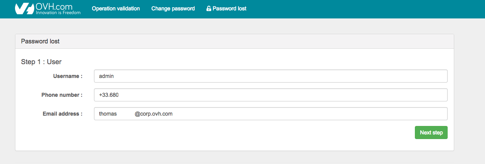

**Ostatnia aktualizacja z dnia 24-04-2019**

## Wprowadzenie

Za pomocą bezpiecznego interfejsu możesz potwierdzić wrażliwe operacje (jak np. zmiana hasła, dodanie użytkownika, etc.) realizowane przez użytkowników lub osoby trzecie mające dostęp do Twojej infrastruktury Private Cloud HDS lub PCI-DSS.

**Dowiedz się, jak korzystać z bezpiecznego interfejsu i potwierdzić „wrażliwe” operacje.**

## Wymagania początkowe

- Posiadanie infrastruktury z opcją **security advanced**, która umożliwia zatwierdzanie „wrażliwych” operacji. Opcja jest zawarta w pakietach [PCI-DSS](https://www.ovh.pl/private-cloud/payment-infrastructure/){.external} i [HDS](https://www.ovh.com/fr/private-cloud/healthcare/){.external}
- Posiadanie bezpiecznego dostępu do wybranej infrastruktury Private Cloud Przykładowo: `https://pcc-xxx-xxx-xxx-xxx.ovh.com/secure/` (uwaga: pamiętaj o umieszczeniu ukośnika „/” na końcu adresu)

## W praktyce

Zatwierdzanie operacji „wrażliwych” w bezpiecznym interfejsie jest możliwe wyłącznie dla użytkowników posiadających uprawnienie **token validator**. Użytkownik „admin” posiada już to uprawnienie, ponieważ jest ono niezbędne do aktywacji opcji **security advanced**. Pamiętaj, że w Panelu klienta możesz przypisać to uprawnienie innym użytkownikom. W razie takiej potrzeby, skorzystaj z dokumentacji [Zarządzanie usługą Private Cloud OVH](../manager-ovh-private-cloud/#uzytkownicy).

Za pośrednictwem bezpiecznego interfejsu możesz wykonać trzy rodzaje operacji. Przejdź do opisu operacji, którą chcesz przeprowadzić. 

- [Zatwierdzenie operacji za pomocą tokena](./#zatwierdzenie-operacji-za-pomoca-tokena)
- [Zmiana hasła dla użytkownika](./#zmiana-hasla-uzytkownika)
- [Reset hasła](./#reset-hasla)

### Zatwierdzenie operacji za pomocą tokena

Po otrzymaniu tokena w wiadomości SMS wprowadź go do bezpiecznego interfejsu, aby uruchomić oczekujące zadanie.

> [!warning]
>
> Dostarczony token ważny jest 15 minut. Jeśli w tym czasie nie zatwierdzisz operacji, zostanie ona anulowana.
> 
> Wykonanie operacji zostanie zaproponowane ponownie w późniejszym czasie (w przypadku konserwacji) lub będziesz musiał wznowić operację (jeśli nastąpi to po Twoim działaniu). 
> 

Poniżej przykład wiadomości SMS, jaką możesz otrzymać: 

{.thumbnail}

Wiadomość zawiera następujące informacje: 

- użytkownik z uprawnieniem **token validator**, który otrzymał wiadomość SMS. Informacja ta pomoże Ci lepiej zarządzać tokenami do potwierdzenia, jeśli wprowadziłeś Twój numer telefonu do kilku kont użytkownika;
- nazwa operacji wymagająca zatwierdzenia;
- ID operacji;
- token do zatwierdzenia operacji;
- link umożliwiający zatwierdzenie operacji (pamiętaj, że jeśli Twój telefon nie jest [podłączony do sieci z autoryzowanym IP, strona się nie wyświetli](https://docs.ovh.com/pl/private-cloud/manager-ovh-private-cloud/#bezpieczenstwo)).

Aby zatwierdzić operację, kliknij link otrzymany w wiadomości. Następnie przejdź do sekcji `Operation Validation`{.action}.

{.thumbnail}

Otworzy się okno, w którym może się zalogować wyłącznie użytkownik z uprawnieniem **token validator**.

Wyświetl operację, wprowadzając jej ID w polu `Operation id` i klikając przycisk `Load operation`{.action}. Następnie wprowadź token, który właśnie otrzymałeś w wiadomości SMS i kliknij `Potwierdź operację`{.action}.

{.thumbnail}

SMS potwierdzający zatwierdzenie operacji zostanie wysłany do użytkowników posiadających uprawnienia **token validator**. Przykład: 

{.thumbnail}

Wiadomość zawiera następujące informacje: 

- użytkownik z uprawnieniem **token validator**, który otrzymał SMS;
- nazwa i ID operacji;
- użytkownik z uprawnieniem **token validator**, który zatwierdził operację. 

### Zmiana hasła użytkownika

Zmiana hasła możliwa jest w przypadku użytkownika posiadającego lub nie uprawnienie **token validator**. Osoba ta musi jednak posiadać swoje aktualne hasło, aby móc przeprowadzić operację.

> [!primary]
>
> Jeśli użytkownik nie posiada hasła, powinien poprosić innego użytkownika posiadającego uprawnienie **token validator** o dokonanie zamiast niego zmiany przy wykorzystaniu procedury [resetu hasła](./#reset-hasla).
> 

Aby zmienić hasło użytkownika, zaloguj się do bezpiecznego interfejsu (na przykład): `https://pcc-xxx-xxx-xxx-xxx.ovh.com/secure/`) i kliknij przycisk `Change Password`{.action}.

{.thumbnail}

Na stronie, która się wyświetla wybierz odpowiedniego użytkownika, po czym zdefiniuj hasło.

Do użytkowników posiadających uprawnienia **token validator** zostanie wysłany token, aby mogli [zatwierdzić operację](./#zatwierdzenie-operacji-za-pomoca-tokena). 

{.thumbnail}

### Reset hasła

Procedura ta jest dozwolona wyłącznie w przypadku użytkowników posiadających uprawnienie **token validator**.

> [!primary]
>
> Jeśli użytkownik nie posiadający uprawnienia **token validator** utraci swoje hasło, powinien poprosić o jego reset innego użytkownika posiadającego to uprawnienie.
> 

Aby zresetować hasło, zaloguj się do bezpiecznego interfejsu (na przykład: `https://pcc-xxx-xxx-xxx-xxx.ovh.com/secure/`) i kliknij przycisk `Password lost`{.action}.

{.thumbnail}

Wyświetla się komunikat informujący, że użytkownik musi mieć możliwość odbierania wiadomości SMS, aby kontynuować. Jeśli tak jest, wprowadź odpowiednie informacje (w szczególności nazwę użytkownika, którego dotyczy reset) i kliknij `Next step`{.action}.

{.thumbnail}

Wprowadź następnie dwa tokeny otrzymane w wiadomości SMS oraz e-mailem, po czym zdefiniuj nowe hasło.

> [!primary]
>
> Jeśli reset przeprowadzony został dla innego użytkownika, osoba, która przeprowadziła tę procedurę powinna przekazać temu użytkownikowi nowe hasło. Zalecamy, aby użytkownik [zmienił otrzymane hasło](./#zmiana-hasla-uzytkownika) jak najszybciej.
> 

{.thumbnail}

## Sprawdź również

Przyłącz się do społeczności naszych użytkowników na stronie <https://community.ovh.com/en/>.