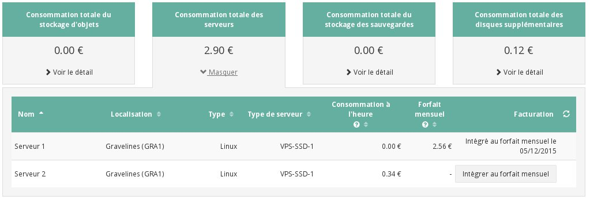

## 
Existen dos tipos de facturación de los recursos de Public Cloud:

- por horas
- mensual

Cada una de estas dos modalidades de facturación puede tener ventajas según cuáles sean sus necesidades. También es posible utilizar las dos dentro de un mismo proyecto.

Conscientes de la necesidad de aclarar este aspecto, hemos desarrollado una herramienta que le permitirá entender mejor su facturación.

Esta guía recuerda las diferencias entre los dos tipos de facturación y explica cómo utilizar la herramienta destinada a analizar y gestionar la facturación.

## Requisitos
Es necesario estar conectado al [área de cliente](https://www.ovh.com/manager/).

## Facturación por horas
Esta modalidad le permite ser facturado en función del consumo que haga de los recursos. Por lo general es la opción más conveniente cuando necesita dichos recursos por poco tiempo.

También es el tipo de facturación que se aplica a otras funcionalidades como el Object Storage, los snapshots o los discos adicionales.

No obstante, se muestra el precio mensual para facilitar la lectura, evitando precios del orden de los céntimos de euro.

Con esta modalidad, se recibe la factura al mes siguiente, una vez calculado el consumo total del mes.

## Atención:
La facturación se realiza en función del consumo de recursos. Si, por ejemplo, apaga una instancia, los recursos seguirán asignados a su instancia, por lo que se seguirán facturando.

## Facturación mensual
Si elige esta modalidad, se compromete a conservar los recursos al menos hasta el final del mes en curso. Es la opción más ventajosa cuando los necesite a largo plazo, ya que le permite ahorrar un 50% en la factura.

La factura se genera de inmediato por un importe proporcional a lo que queda del mes.

## Atención:
Si elimina un recurso en el transcurso del mes, ello no reducirá la factura ni se añadirá el tiempo de uso equivalente al importe no utilizado.

## Estimación y detalles
Para acceder a la sección de facturación desde el área de cliente Cloud, haga clic en «Gestión y consumo del proyecto».

{.thumbnail}
Por defecto se abrirá el menú «Consumo».

{.thumbnail}
En esta página podrá ver la información de facturación y consumo.

Elija el mes que quiera consultar. Por defecto se mostrará el mes en curso.

Debajo se mostrará un gráfico como el de la imagen:

{.thumbnail}
A la izquierda podrá ver la información relativa a la facturación del mes elegido:

- Renovación de los recursos facturados mensualmente.
- Importe del consumo de recursos por horas durante el mes anterior.

Debajo verá una barra de progreso que muestra el importe de la facturación en un momento determinado. Dicho importe representa la cantidad a pagar si eliminase inmediatamente todos los recursos, es decir:

- instancias
- snapshots
- discos adicionales
- Object Storage

A la derecha encontrará la estimación de la factura que se generaría a principios del mes siguiente. Dicha factura se calcula en función de los recursos que tiene en ese momento y no tiene en cuenta la tarificación del ancho de banda saliente para el Object Storage o la adición de recursos adicionales.

También puede crear una alerta que le informe cuando el importe estimado supere el coste que usted establezca.

Bajo esta gráfica podrá ver una tabla que indica el importe de la facturación por tipo de recurso.

{.thumbnail}
Esta tabla no muestra ninguna estimación, sino el consumo real en el momento de la consulta.

Haga clic en «Ver el detalle» para ver la lista de recursos creados durante el mes seleccionado.

## Importante:
Si la instancia ha sido eliminada, se mostrará su ID en lugar de su nombre.

## Creación de alertas
Es posible crear alertas para recibir un mensaje de correo electrónico cuando se supere un importe determinado en la estimación de la factura.

Para ello, haga clic en el botón «Alerta de consumo».

A continuación, podrá ver un nuevo menú:

{.thumbnail}
En él podrá configurar:

- La dirección de correo electrónico en la que quiere recibir la alerta.
- El importe a partir del cual quiere recibir la alerta.

Una vez superado dicho importe, recibirá una alerta cada 90 minutos.

## Importante:
La creación de alertas solo permite recibir una notificación por correo electrónico. La actividad no será bloqueada en caso de superar el importe elegido.
