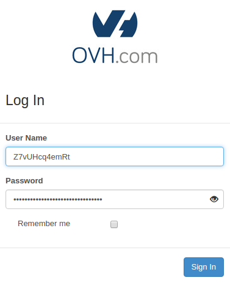
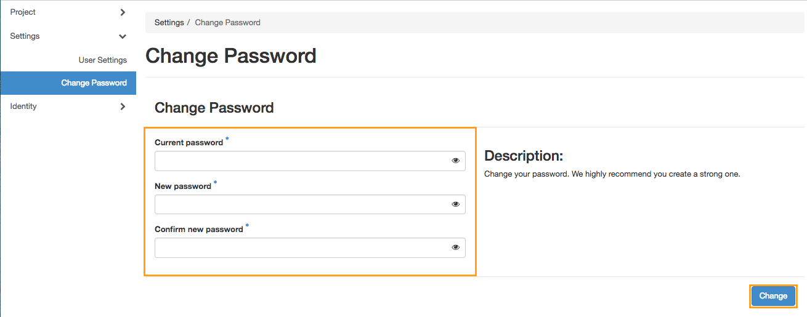

**Ostatnia aktualizacja dnia 2018-01-24**

## Wprowadzenie

W przewodniku [Dostęp do panelu Horizon](https://docs.ovh.com/pl/public-cloud/tworzenie_dostepu_do_interfejsu_horizon/){.external} pokazano, jak stworzyć i usunąć użytkownika OpenStack oraz wygenerować hasło dostępowe.
Za pomocą panelu Horizon można ustawić własne hasło dla danego użytkownika. 
Zmiana hasła do konta użytkownika powoduje unieważnienie aktywnych tokenów w momencie zmiany.

## Wymagania początkowe

- Utworzone konto użytkownika OpenStack Horizon

## W praktyce

Ustanowienie hasła OpenStack możliwe jest po zalogowaniu do panelu OpenStack Horizon <https://horizon.cloud.ovh.net>:

{.thumbnail}

W prawym górnym rogu ekranu widoczny jest identyfikator użytkownika Horizon. Po kliknięciu na identyfikator rozwinie się menu z dostępnymi opcjami. 
Należy wybrać Ustawienia, a następnie po lewej stronie "Zmień hasło":

{.thumbnail}

W pierwszym polu wprowadź aktualne hasło, a w dwóch kolejnych polach dwukrotnie nowe hasło.

Zalecamy ustawienie mocnego (skomplikowanego) hasła w celu zapewnienia odpowiedniej ochrony dostępu. 

Na koniec należy potwierdzić ustanowienie nowego hasła, w prawym dolnym rogu, za pomocą przycisku Zmień:

{.thumbnail}

Prosimy pamiętać, że zmiana hasła do konta użytkownika powoduje natychmiastowe unieważnienie dotychczasowo używanych tokenów.

## Sprawdź również

Przyłącz się do społeczności naszych użytkowników na stronie <https://community.ovh.com/en/>.