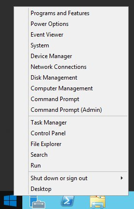

## 
Es posible crear discos adicionales para sus instancias de Public Cloud.

Esto puede ser útil en los siguientes casos:


- si quiere aumentar su capacidad de almacenamiento sin cambiar el modelo de instancia,
- si quiere espacio de almacenamiento de alta disponibilidad y alto rendimiento,
- si quiere poder mover su espacio de almacenamiento y los datos que contiene a otra instancia.


Esta guía explica cómo crear un disco adicional y configurarlo en una de sus instancias.


## Requisitos
Para seguir todas las etapas de esta guía, es necesario disponer de una instancia.


## 
Conéctese al [área de cliente Cloud](https://www.ovh.com/manager/cloud/) de OVH.

Haga clic en el botón «Añadir» y seleccione «Añadir un disco».

{.thumbnail}
Desde este nuevo menú, asigne un nombre al disco y seleccione el tipo de disco:

|Clásico|200 IOPS garantizadas|
|Alto rendimiento|Hasta 3000 IOPS|


Elija la capacidad del disco, desde 10 GB.

Elija la región de localización del disco.

Por último, haga clic en «Aceptar» para crear el disco.
Se mostrará una nueva caja con el disco.

{.thumbnail}
A continuación podrá asociar el disco adicional a una instancia de dos formas:


- Arrastre el disco a la instancia.
- Haga clic en la flecha situada bajo el disco y seleccione «Asociar a un servidor».


Una vez hecho, el disco aparecerá bajo la instancia correspondiente.

{.thumbnail}


## Desde una instancia Linux
Consulte la lista de discos:


```
admin@server1:~$ lsblk

NAME MAJ:MIN RM SIZE RO TYPE MOUNTPOINT
vda 254:0 0 10G 0 disk
└─vda1 254:1 0 10G 0 part /
vdb 254:16 0 10G 0 disk
```


Importante: Por lo general VDA corresponde al disco de la instancia, de modo que VDB será el disco adicional.
Cree una partición:


```
admin@server1:~$ sudo fdisk /dev/vdb

Welcome to fdisk (util-linux 2.25.2).
Changes will remain in memory only, until you decide to write them.
Be careful before using the write command.

Device does not contain a recognized partition table.
Created a new DOS disklabel with disk identifier 0x95c4adcc.
```


```
Command (m for help): n

Partition type
p primary (0 primary, 0 extended, 4 free)
e extended (container for logical partitions)
Select (default p):
Using default response p.
Partition number (1-4, default 1):
First sector (2048-20971519, default 2048):
Last sector, +sectors or +size{K,M,G,T,P} (2048-20971519, default 20971519):

Created a new partition 1 of type 'Linux' and of size 10 GiB.
```


```
Command (m for help): w

The partition table has been altered.
Calling ioctl() to re-read partition table.
Syncing disks.
```


Formatee la partición:


```
admin@server1:~$ sudo mkfs.ext4 /dev/vdb1
mke2fs 1.42.12 (29-Aug-2014)
Creating filesystem with 2621184 4k blocks and 655360 inodes
Filesystem UUID: 781be788-c4be-462b-b946-88429a43c0cf
Superblock backups stored on blocks:
32768, 98304, 163840, 229376, 294912, 819200, 884736, 1605632

Allocating group tables: done
Writing inode tables: done
Creating journal (32768 blocks): done
Writing superblocks and filesystem accounting information: done
```


Monte la partición:


```
admin@server1:~$ sudo mkdir /mnt/disk
admin@server1:~$ sudo mount /dev/vdb1 /mnt/disk/
```


Compruebe el montaje:


```
admin@server1:~$ df -h

Filesystem Size Used Avail Use% Mounted on
/dev/vda1 9.8G 840M 8.6G 9% /
udev 10M 0 10M 0% /dev
tmpfs 393M 5.2M 388M 2% /run
tmpfs 982M 0 982M 0% /dev/shm
tmpfs 5.0M 0 5.0M 0% /run/lock
tmpfs 982M 0 982M 0% /sys/fs/cgroup
/dev/vdb1 9.8G 23M 9.2G 1% /mnt/disk
```


Si se trata del montaje de un disco persistente, deberá editar el archivo /etc/fstab como se indica a continuación.

Obtenga el ID del bloque:


```
admin@server1:~$ sudo blkid

/dev/vda1: UUID="51ba13e7-398b-45f3-b5f3-fdfbe556f62c" TYPE="ext4" PARTUUID="000132ff-01"
/dev/vdb1: UUID="2e4a9012-bf0e-41ef-bf9a-fbf350803ac5" TYPE="ext4" PARTUUID="95c4adcc-01"
```


Añada el disco al archivo /etc/fstab:


```
admin@serveur-1:~$ vim /etc/fstab

/etc/fstab: static file system information.

# Use 'blkid' to print the universally unique identifier for a
# device; this may be used with UUID= as a more robust way to name devices
# that works even if disks are added and removed. See fstab(5).
#
# <file system> <mount point> <type> <options> <dump> <pass>
UUID=51ba13e7-398b-45f3-b5f3-fdfbe556f62c / ext4 defaults 0 0
UUID=2e4a9012-bf0e-41ef-bf9a-fbf350803ac5 /mnt/disk ext4 nofail 0 0
```


## Desde una instancia Windows
Acceda a la herramienta de administración de discos.

{.thumbnail}
Formatee el disco.

{.thumbnail}
Atención: Si aparece el mensaje «offline (the disk is offline because of policy set by an administrator)», deberá editar los atributos de los discos haciendo clic derecho en el disco, y seleccionado «Online» y luego «Initialize», o utilizando Diskpart como se indica a continuación.

Ejecute Powershell o una consola de comandos.

Compruebe la estrategia aplicada:


```
PS C:\> diskpart
DISKPART> san

SAN Policy: Offline Shared
```


Cambie la estrategia:


```
DISKPART> san policy=OnlineAll

DiskPart successfully changed the SAN policy for the current operating system.
```


Aplique la estrategia en el disco adicional:


```
DISKPART> list disk

Disk ### Status Size Free Dyn Gpt
-------- ------------- ------- ------- --- ---
Disk 0 Online 200 GB 0 B
* Disk 1 Offline 10 GB 1024 KB
```


```
DISKPART> select disk 1

Disk 1 is now the selected disk.
```


```
DISKPART> attributes disk clear readonly

Disk attributes cleared successfully.
```


```
DISKPART> attributes disk

Current Read-only State: No
Read-only: No
Boot Disk: No
Pagefile Disk: No
Hibernation File Disk: No
Crashdump Disk: No
Clustered Disk: No
```


```
DISKPART> online disk

DiskPart successfully onlined the selected disk.
```


Arranque el disco desde la herramienta de administración de discos y formatéelo.
Una vez formateado el disco, podrá acceder a él fácilmente desde el explorador de archivos.

{.thumbnail}
