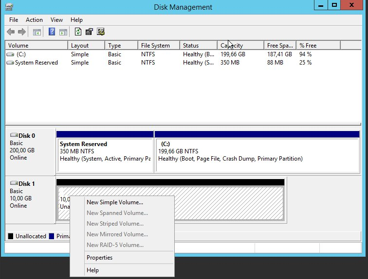

## 
É possível que crie discos adicionais para as suas instâncias Public Cloud.
Eles podem ser adicionais para:

- Aumentar a sua capacidade de armazenamento sem mudar para um modelo superior.
- Dispor de um espaço de armazenamento de alta disponível e com melhores performances.
- Poder migrar os seus dados para outra instância


Este guia explica-lhe como poderá criar um disco suplementar e explica-lhe ainda como o configurar numa das suas instâncias.


## Pré-requisitos

- Uma instância


## 

- Ligue-se a [Espaço Cliente OVH](https://www.ovh.com/manager/cloud/)
- Clique no botão "Adicionar" e selecione "Adicionar um disco"


{.thumbnail}
Poderá, neste menu, efetuar as seguintes operações:

- Atribuir um nome ao seu disco
- Selecionar o tipo de disco:

|Clássico|200 IOPS garantidos|
|Alta performance|Até 3000 IOPS|


- Escolher a capacidade do disco: a partir de 10GB
- Escolher a região do seu disco
- Validar a criação do disco


De seguida aparecerá uma nova janela com o seu disco:

{.thumbnail}
Poderá de seguida associar o seu disco suplementar a uma instância:

- Basta efetuar um arrastar/largar (drag and drop) do seu disco na sua instância.
- Ao clicar na seta à direita do seu disco e ao selecionar "Associar a um servidor".


Após efetuar este processo o disco aparecerá por baixo da instância:

{.thumbnail}


## A partir de uma instância Linux

- Liste os discos

```
admin@serveur-1:~$ lsblk

NAME MAJ:MIN RM SIZE RO TYPE MOUNTPOINT
vda 254:0 0 10G 0 disk
└─vda1 254:1 0 10G 0 part /
vdb 254:16 0 10G 0 disk
```


O VDA corresponde geralmente ao disco da sua instãncia, o VDB será então o disco suplementar

- Criar uma partição

```
admin@serveur-1:~$ sudo fdisk /dev/vdb

Welcome to fdisk (util-linux 2.25.2).
Changes will remain in memory only, until you decide to write them.
Be careful before using the write command.

Device does not contain a recognized partition table.
Created a new DOS disklabel with disk identifier 0x95c4adcc.
```


```
Command (m for help): n

Partition type
p primary (0 primary, 0 extended, 4 free)
e extended (container for logical partitions)
Select (default p):
Using default response p.
Partition number (1-4, default 1):
First sector (2048-20971519, default 2048):
Last sector, +sectors or +size{K,M,G,T,P} (2048-20971519, default 20971519):

Created a new partition 1 of type 'Linux' and of size 10 GiB.
```


```
Command (m for help): w

The partition table has been altered.
Calling ioctl() to re-read partition table.
Syncing disks.
```


- Formatar a partição

```
admin@serveur-1:~$ sudo mkfs.ext4 /dev/vdb1
mke2fs 1.42.12 (29-Aug-2014)
Creating filesystem with 2621184 4k blocks and 655360 inodes
Filesystem UUID: 781be788-c4be-462b-b946-88429a43c0cf
Superblock backups stored on blocks:
32768, 98304, 163840, 229376, 294912, 819200, 884736, 1605632

Allocating group tables: done
Writing inode tables: done
Creating journal (32768 blocks): done
Writing superblocks and filesystem accounting information: done
```


- Montar a partição

```
admin@serveur-1:~$ sudo mkdir /mnt/disk
admin@serveur-1:~$ sudo mount /dev/vdb1 /mnt/disk/
```


- Verificação da montagem

```
admin@serveur-1:~$ df -h

Filesystem Size Used Avail Use% Mounted on
/dev/vda1 9.8G 840M 8.6G 9% /
udev 10M 0 10M 0% /dev
tmpfs 393M 5.2M 388M 2% /run
tmpfs 982M 0 982M 0% /dev/shm
tmpfs 5.0M 0 5.0M 0% /run/lock
tmpfs 982M 0 982M 0% /sys/fs/cgroup
/dev/vdb1 9.8G 23M 9.2G 1% /mnt/disk
```


Para montar o disco de forma persistente é necessário modificar o ficheiro /etc/fstab:


- Recuperar o ID do bloco

```
admin@serveur-1:~$ sudo blkid

/dev/vda1: UUID="51ba13e7-398b-45f3-b5f3-fdfbe556f62c" TYPE="ext4" PARTUUID="000132ff-01"
/dev/vdb1: UUID="2e4a9012-bf0e-41ef-bf9a-fbf350803ac5" TYPE="ext4" PARTUUID="95c4adcc-01"
```


- Adicionar o seu disco ao ficheiro /etc/fstab :

```
admin@serveur-1:~$ vim /etc/fstab

/etc/fstab: static file system information.

# Use 'blkid' to print the universally unique identifier for a
# device; this may be used with UUID= as a more robust way to name devices
# that works even if disks are added and removed. See fstab(5).
#
# <file system> <mount point> <type> <options> <dump> <pass>
UUID=51ba13e7-398b-45f3-b5f3-fdfbe556f62c / ext4 defaults 0 0
UUID=2e4a9012-bf0e-41ef-bf9a-fbf350803ac5 /mnt/disk ext4 nofail 0 0
```


## A partir de uma instância Windows

- Aceda à ferramenta de gestão de discos


{.thumbnail}

- Formatar o disco


{.thumbnail}
Atenção:
Se recee a mensage "offline (the disk is offline because of policy set by an administrator)", será necessário modificar os atributos dos discos ao efetuar um clique direito no seu disco e depois selecionar "Online", devendo de seguida clicar em "Initialize" ou ao utilizar a ferramenta Diskpart:


- Lancer Powershell ou uma linha de comandos
- Verificação da "policy" aplicada:

```
PS C:\> diskpart
DISKPART> san

SAN Policy : Offline Shared
```


- Alterar a "policy":

```
DISKPART> san policy=OnlineAll

DiskPart successfully changed the SAN policy for the current operating system.
```


- Aplicação da "policy" no disco suplementar:

```
DISKPART> list disk

Disk ### Status Size Free Dyn Gpt
-------- ------------- ------- ------- --- ---
Disk 0 Online 200 GB 0 B
* Disk 1 Offline 10 GB 1024 KB
```


```
DISKPART> select disk 1

Disk 1 is now the selected disk.
```


```
DISKPART> attributes disk clear readonly

Disk attributes cleared successfully.
```


```
DISKPART> attributes disk

Current Read-only State : No
Read-only : No
Boot Disk : No
Pagefile Disk : No
Hibernation File Disk : No
Crashdump Disk : No
Clustered Disk : No
```


```
DISKPART> online disk

DiskPart successfully onlined the selected disk.
```


- Inicie o disco a partir do gestor de discos e proceda de seguida à formatação do disco.


Após o disco ter sido formatado, já será possível que aceda ao mesmo através do explorador de ficheiros.

{.thumbnail}


## 
[Voltar à página principal dos guias Cloud]({legacy}1785)

