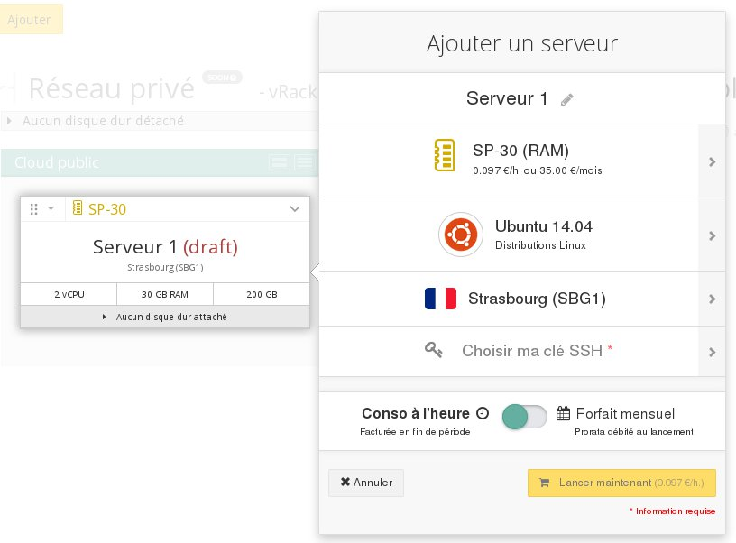

## 
Il Public Cloud OVH ti permette di creare server virtuali (istanze), in qualsiasi momento e in tutta semplicità.
Queste istanze sono molto simili ai [VPS OVH](https://www.ovh.it/vps/) di ultima generazione, ma rispondono anche ad altre esigenze.
Ecco le caratteristiche principali dei VPS e delle istanze Public Cloud:

VPS:

- Spazio Cliente OVH semplificato
- visione su una singola macchina
- numerose distribuzioni disponibili

Istanze Public Cloud:

- Possibilità di scelta della fatturazione: mensile o oraria
- API OpenStack disponibili
- richieste distribuite tra più istanze

Questa guida ti mostra la procedura da seguire per creare un'istanza.

## Requisiti

- Avere accesso allo [Spazio Cliente OVH Cloud](https://www.ovh.com/manager/cloud/)
- Aver già creato e configurato una chiave SSH nel tuo Spazio Cliente OVH

Guida: 

## Aggiungi il server

- Clicca su Aggiungi in alto a sinistra

{.thumbnail}

- Seleziona Aggiungi un server

{.thumbnail}

## Scegli le caratteristiche del server

- Clicca sulla freccia che si trova sul lato destro del modello. Visualizzerai un altro menu:

{.thumbnail}
Scegli il tipo di istanza:

- Gamma VPS-SSD

|da 1 a 2 vCore|da 2 GB a 8 GB di RAM|da 10 a 40 GB di storage|

- Gamma CPU

|da 2 a 32 vCore|da 7 GB a 120 GB di RAM|da 200 a 1600 GB di storage|

- Gamma RAM

|da 2 a 16 vCore|da 30 GB a 240 GB di RAM|da 200 a 1600 GB di storage|

## Scegli il sistema operativo

- Ad esempio Ubuntu 14.04

{.thumbnail}

## Scegli il datacenter

- Ad esempio Strasburgo

{.thumbnail}

## Seleziona la chiave SSH che vuoi utilizzare

- Ad esempio:

{.thumbnail}

## Informazione:
Quando crei un'istanza Windows, non è necessario configurare una chiave SSH.

## Rinomina il server virtuale e inizia!

- Rinomina il server virtuale 
- Scegli la Fatturazione (oraria o mensile)

## Attenzione:
Scegliendo la fatturazione mensile per la tua istanza, ti impegni a mantenere questa tariffa almeno fino alla fine del mese in corso.

- Clicca su Avvia adesso

## 
[Ritorna all'indice delle guide Cloud]({legacy}1785)

