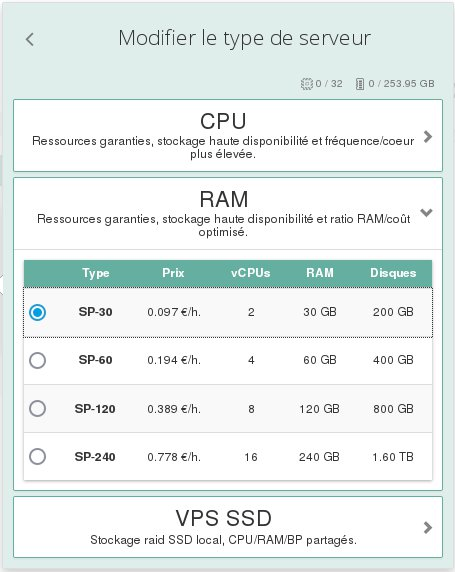
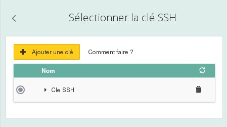

## 
O Public Cloud permite-lhe a qualquer momento criar rapidamente e facilmente servidores virtuais (instâncias) em apenas alguns cliques.
Estas instâncias são similares às [VPS OVH](https://www.ovh.pt/vps/) de última geração, mas oferecem outras funcionalidades. As principais diferenças entre as VPS e as instâncias Public Cloud são:

VPS:

- Área de cliente simples
- Orientado para "mono-machine"
- São oferecidas um grande número de distribuições

Instância Public Cloud:

- Escolha da faturação: mensal ou à hora
- API OpenStack
- As instâncias trabalham em conjunto

Este guia explica-lhe o procedimento a seguir para criar uma instância.

## Pré-requisitos

- Ligação estabelecida ao [Espaço Cliente OVH](https://www.ovh.com/manager/cloud/)
- Ter criado e configurado uma chave SSH na interface Espaço Cliente OVH

Guia: 

## Adição do servidor

- Clicar no botão Adicionar no canto superior esquerdo

{.thumbnail}

- Escolher Adicionar um servidor

{.thumbnail}

## Escolher as características do servidor

- Ao clicar na seta para a direita do modelo um novo menu será apresentado

{.thumbnail}
Poderá escolher o tipo da sua instância:

- Gama VPS SSD

|de 1 a 2 vCores|de 2GB a 8GB de RAM|de 10 a 40GB de espaço de armazenamento|

- Gama CPU

|de 2 a 32 vCores|de 7 a 120GB de RAM|de 200 a 1600GB de espaço de armazenamento|

- Gama RAM

|de 2 a 16 vCores|de 30 a 240GB de RAM|de 200 a 1600GB de espaço de armazenamento|

## Escolher o sistema operativo

- Por exemplo, Ubuntu 14.04

{.thumbnail}

## Escolher a região de datacenters

- Por exemplo, Estrasburgo

{.thumbnail}

## Selecionar a chave SSH a utilizar

- Por exemplo:

{.thumbnail}

## Informações
Aquando da criação de uma instância Windows não é necessário configurar uma chave SSH

## Atribuir um nome ao servidor virtual e iniciar a sua execução

- Atribuir um nome ao servidor;
- Escolher o tipo de faturação ("à hora" ou "ao mês").

## Atenção:
Quando cria uma instância com faturação "ao mês", compromete-se a manter a mesma, pelo menos, até ao final do mês em curso (mesmo que não a mantenha, pagará a utilização mensal).

- Clique em Iniciar agora

## 
[Regresso à lista dos guias Cloud]({legacy}1785)

