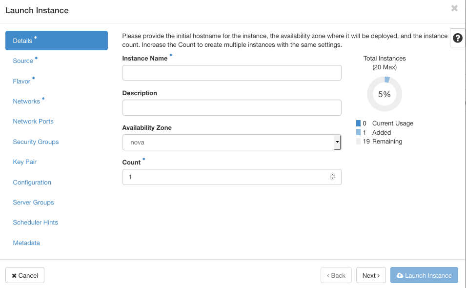

**Última atualização: 23/04/2019**

## Sumário

Tem a possibilidade de criar instâncias diretamente a partir da interface Horizon. Isto permite-lhe, por exemplo, criar múltiplas instâncias ou ainda configurar um grupo de segurança e aplicá-lo às suas instâncias.

**Saiba como criar uma instância a partir da interface Horizon.**

## Requisitos

- Dispor de um projeto [Public Cloud](https://www.ovh.pt/public-cloud/instances/){.external} na sua conta OVH.
- [Ter acesso à interface Horizon](../criar_um_acesso_a_interface_horizon/){.external}. 

## Instruções

Para começar a criar uma instância, aceda à interface Horizon. Se precisar de ajuda para realizar esta operação, consulte o nosso manual “[Criar um acesso à interface Horizon](../criar_um_acesso_a_interface_horizon/){.external}”.

A seguir, clique em `Compute`{.action} no menu à esquerda e, de seguida, em `Instances`{.action}.

{.thumbnail}

A nova página que aparece permite visualizar as instâncias atualmente lançadas. Para iniciar uma nova instância, clique no botão `Lançar uma instância`{.action}.

{.thumbnail}

Deverá preencher as diferentes informações. Caso seja necessário, consulte a tabela abaixo para obter ajuda ao preencher os campos. Lembre-se de que esta tabela não é exaustiva. 

|Informação|Detalhes|
|---|---|
|Zona de disponibilidade|Deixe “nova” (escolha predefinida)|
|Nome da instância|Indique o nome que pretende dar à instância que vai criar|
|Tipo|Indique o tipo de instância que quer criar|
|Número de instâncias|Indique o número de instâncias que pretende criar|
|Origem de arranque da instância|Selecione a origem para a criação da instância a partir de uma imagem ou a partir de uma snapshot|
|Nome da imagem|Selecione a imagem da instância (apenas em caso de arranque a partir de uma imagem)|
|Snapshot da instância|Selecione uma snapshot de uma instância (apenas em caso de arranque a partir de uma snapshot)|
|Par de chaves|Selecione uma chave SSH para se ligar à instância (a criação de uma chave pode ser realizada clicando no símbolo “+”)|
|Grupos de segurança|Indique o grupo de segurança para a instância (autorização de abertura de portas)|
|Redes selecionadas|Selecione a(s) rede(s) para a instância que pretende criar na lista das redes disponíveis|
|Fonte de script personalizado|Indique a fonte entre uma “entrada direta” ou um “ficheiro”|
|Dados de script|Indique o código do script no campo (máximo de 16 KB)|
|Ficheiro do script|Clique em Navegar para selecionar o script de pós-instalação|
|Particionamento do disco|Escolha entre “automático” ou “manual”|
|Disco de configuração|Configure o OpenStack para escrever os metadados num disco de configuração específico que ficará associado à instância no momento do lançamento|

Assim que estiver pronto para lançar a(s) instância(s) pretendida(s), clique no botão `Iniciar`{.action}.

{.thumbnail}

## Quer saber mais?

Fale com a nossa comunidade de utilizadores em <https://community.ovh.com/en/>.