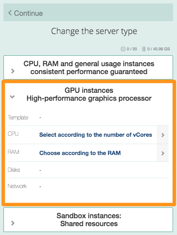
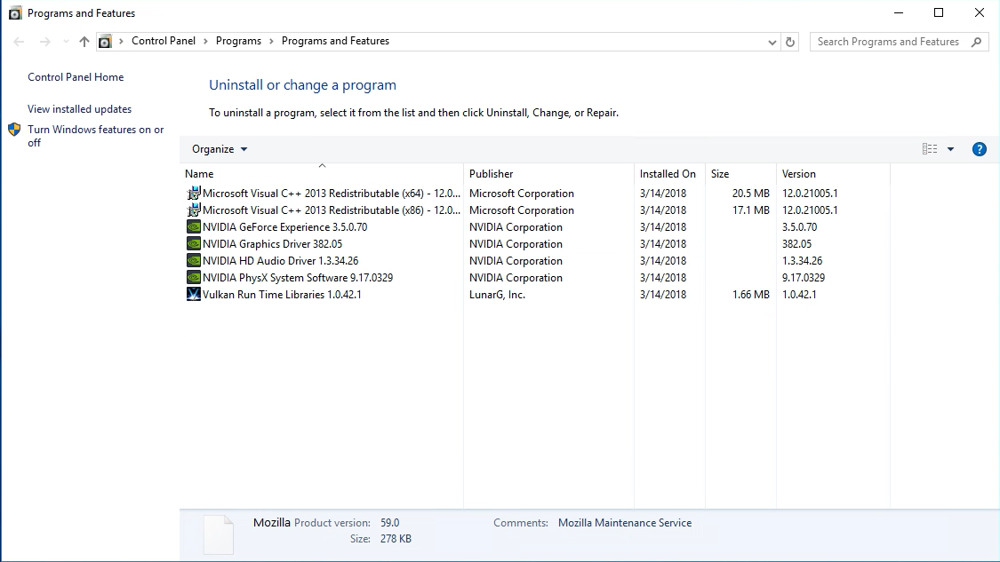

**Stand 18.12.2018**

## Einleitung

GPU Instanzen sind den anderen Instanzen der Produktreihe 2017 technisch sehr ähnlich, verfügen jedoch über eine Grafikkarte (Graphic Processing Unit oder kurz GPU). Die verwendete Technologie (*pci_passthrough*) ermöglicht es dem Betriebssystem der Instanz, die GPU genau wie auf einer physischen Maschine zu kontrollieren.

OVH bietet die folgenden GPUs: NVIDIA GeForce GTX 1060, GTX 1070 und GTX 1080Ti. 

> [!warning]
>
> GPU Instanzen sind im Moment nur in den Rechenzentren GRA3, GRA5 und BHS3 verfügbar. Es kann daher sein, dass Sie ein neues Projekt erstellen und die 2017er Reihe auswählen müssen. Weitere Informationen finden Sie [hier](https://docs.ovh.com/gb/en/public-cloud/faq-how-to-understand-the-new-flavor-naming-rules-for-the-2017-range/) (Englisch).
> 

**In dieser Anleitung erfahren Sie, wie Sie eine GPU Instanz unter Linux oder Windows einrichten.**


## Voraussetzungen

- Sie haben ein Public Cloud Projekt mit Zugriff auf die Regionen erstellt, in denen GPU Instanzen verfügbar sind (GRA3, GRA5 und BHS3).

## Beschreibung

Im Folgenden erklären wir Ihnen, wie Sie eine GPU Instanz unter Linux oder Windows einrichten.


### Linux

Alle von uns zur Verfügung gestellten Images können auf GPU Instanzen verwendet werden.

> [!primary]
>
> Wenn Sie das Kernel-Modul nicht manuell kompilieren möchten, empfehlen wir Ihnen, eine offiziell von Nvidia unterstützte Distribution zu verwenden, für die Sie einsatzbereite Treiber herunterladen können: <https://developer.nvidia.com/cuda-downloads>.
> 

Loggen Sie sich in Ihr [OVH Kundencenter ](https://www.docs.ovh.com/auth/?action=gotomanager){.external}ein und wählen Sie Ihr Public Cloud Projekt aus. Klicken Sie dann auf `Aktionen`{.action}, `Server hinzufügen`{.action} und wählen Sie eine GPU Instanz aus:

{.thumbnail}

Wenige Sekunden später wird die Instanz gestartet. Sie können sich dann auf Ihrer Instanz einloggen und überprüfen, ob die Grafikkarte erkannt wird: 

```ssh
lspci | grep -i nvidia
00:05.0 VGA compatible controller: NVIDIA Corporation Device 1c03 (rev a1)
00:06.0 Audio device: NVIDIA Corporation Device 10f1 (rev a1)
```

Die Karte ist vorhanden, kann jedoch noch nicht verwendet werden, da zuerst die zugehörigen NVIDIA-Treiber installiert werden müssen. Die verfügbaren Pakete finden Sie [hier](http://developer.download.nvidia.com/compute/cuda/repos/){.external}.

Geben Sie nun die folgenden Befehle ein:

```sh
wget URL_des_herunterzuladenden_pakets
sudo dpkg -i cuda-repo-XXXX-XXXXXX
sh apt-get update
apt-get upgrade
apt-get install cuda
sudo reboot
```

> [!primary]
>
> Der Linux-Befehl kann je nach installierter Distribution variieren. Wenn Sie sich nicht sicher sind, lesen Sie bitte die offizielle Dokumentation Ihrer Linux-Version.
> 


Nach dem Neustart der Instanz erscheint die Grafikkarte im NVIDIA-Dienstprogramm:

```sh
nvidia-smi
Wed Apr 26 13:05:25 2017
+-----------------------------------------------------------------------------+
| NVIDIA-SMI 375.51                 Driver Version: 375.51                    |
|-------------------------------+----------------------+----------------------+
| GPU  Name        Persistence-M| Bus-Id        Disp.A | Volatile Uncorr. ECC |
| Fan  Temp  Perf  Pwr:Usage/Cap|         Memory-Usage | GPU-Util  Compute M. |
|===============================+======================+======================|
|   0  GeForce GTX 106...  Off  | 0000:00:05.0     Off |                  N/A |
|  0%   22C    P0    26W / 120W |      0MiB /  6072MiB |      0%      Default |
+-------------------------------+----------------------+----------------------+

+-----------------------------------------------------------------------------+
| Processes:                                                       GPU Memory |
|  GPU       PID  Type  Process name                               Usage      |
|=============================================================================|
|  No running processes found                                                 |
+-----------------------------------------------------------------------------+
```

Die GPU Instanz ist nun voll funktionsfähig und kann verwendet werden.


### Windows

Der Nvidia-Treiber und die Virtualisierungslösung *KVM/pci_passthrough* sind nicht voll kompatibel. **Die Windows-Standard-Images funktionieren nicht.**

Wir stellen spezielle Images zur Verfügung, die auf einem virtuellen UEFI-BIOS basieren, damit der Treiber korrekt funktioniert:

{.thumbnail}


> [!warning]
>
> Wir können leider nicht garantieren, dass diese Lösung für alle zukünftigen Versionen des NVIDIA-Treibers funktioniert.
>
> Daher empfehlen wir Ihnen, vor einem Update des NVIDIA-Treibers unbedingt einen Snapshot zu erstellen, um falls nötig zu einem vorherigen Zustand zurückzukehren.
>

Nach dem Start Ihrer GPU Instanz, installieren Sie den NVIDIA-Treiber über die [offizielle Website](http://www.nvidia.de/Download/index.aspx){.external}.

Starten Sie eine Instanz mit einem der GPU-Typen (win-g1-15, win-g1-30, …).

Die Instanz wird nach wenigen Minuten gestartet. Installieren Sie nun noch den notwendigen Treiber, der hier erscheint:


{.thumbnail}

{.thumbnail}


## Weiterführende Informationen

Für den Austausch mit unserer User Community gehen Sie auf <https://community.ovh.com/en/>.