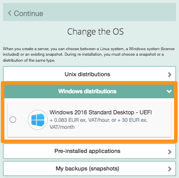

**Última actualización: 01/10/2018**

## Objetivo

Las instancias GPU son técnicamente similares a las demás instancias de la gama 2017, pero disponen además de una tarjeta gráfica (*graphic processing unit* o GPU). La tecnología utilizada (pci_passthrough) permite que el sistema operativo de la instancia controle la GPU exactamente igual que en una máquina física.

OVH ofrece tarjetas gráficas NVIDIA GeForce GTX 1060, GTX 1070 y GTX 1080Ti. 

> [!warning]
>
> Actualmente las instancias GPU solo están disponibles en los datacenters GRA3, GRA5 y BHS3. Para poder disfrutar de estas instancias, es posible que necesite crear un nuevo proyecto y seleccionar la nueva gama 2017. Para más información, consulte [esta guía](https://docs.ovh.com/gb/en/public-cloud/faq-how-to-understand-the-new-flavor-naming-rules-for-the-2017-range/) (en inglés).
> 

**Esta guía explica cómo desplegar una instancia GPU en Linux o Windows.**


## Requisitos

* Haber creado un proyecto de [Public Cloud](https://www.ovh.es/public-cloud/instancias/){.external} con acceso a las regiones en las que las instancias GPU están disponibles (GRA3, GRA5 y BHS3).

## Procedimiento

Es posible desplegar una instancia GPU en Linux o en Windows.


### En Linux

Todas las imágenes que ofrece OVH son compatibles con las instancias GPU.

> [!primary]
>
> Si prefiere no compilar usted mismo el módulo de kernel manualmente, le recomendamos que utilice una distribución que sea oficialmente compatible con NVIDIA y para la que ofrezca drivers listos para usar: <https://developer.nvidia.com/cuda-downloads>.
> 

Una vez que se haya conectado al [área de cliente de OVH](https://www.ovh.com/auth/?action=gotomanager){.external}, acceda a su proyecto de Public Cloud, haga clic en `Acciones`{.action} y seleccione `Añadir un servidor`{.action}. Elija una instancia GPU.

{.thumbnail}

La instancia se iniciará al cabo de unos segundos. Una vez iniciada, puede conectarse a ella y comprobar que detecte la tarjeta gráfica: 

```ssh
lspci | grep -i nvidia
00:05.0 VGA compatible controller: NVIDIA Corporation Device 1c03 (rev a1)
00:06.0 Audio device: NVIDIA Corporation Device 10f1 (rev a1)
```

La instancia detecta la tarjeta gráfica, pero todavía no puede utilizarla, ya que es necesario instalar los drivers NVIDIA. Puede consultar la lista de los paquetes disponibles en el siguiente [enlace](http://developer.download.nvidia.com/compute/cuda/repos/){.external}.

Ejecute los siguientes comandos:

```sh
wget URL_del_paquete_a_descargar
sudo dpkg -i cuda-repo-XXXX-XXXXXX
sudo apt-get update
sudo apt-get upgrade
sudo apt-get install cuda
sudo reboot
```

> [!primary]
>
> El comando Linux puede variar en función de la distribución. En caso de duda, consulte la documentación oficial de su versión Linux.
> 


Una vez reiniciada la instancia, la tarjeta gráfica aparecerá en la utilidad de NVIDIA:

```sh
nvidia-smi
Wed Apr 26 13:05:25 2017
+-----------------------------------------------------------------------------+
| NVIDIA-SMI 375.51                 Driver Version: 375.51                    |
|-------------------------------+----------------------+----------------------+
| GPU  Name        Persistence-M| Bus-Id        Disp.A | Volatile Uncorr. ECC |
| Fan  Temp  Perf  Pwr:Usage/Cap|         Memory-Usage | GPU-Util  Compute M. |
|===============================+======================+======================|
|   0  GeForce GTX 106...  Off  | 0000:00:05.0     Off |                  N/A |
|  0%   22C    P0    26W / 120W |      0MiB /  6072MiB |      0%      Default |
+-------------------------------+----------------------+----------------------+

+-----------------------------------------------------------------------------+
| Processes:                                                       GPU Memory |
|  GPU       PID  Type  Process name                               Usage      |
|=============================================================================|
|  No running processes found                                                 |
+-----------------------------------------------------------------------------+
```

La instancia GPU ya está plenamente operativa y lista para su uso.


### En Windows

Debido a la existencia de incompatibilidades entre el driver NVIDIA y la solución de virtualización KVM/pci_passthrough, **las imágenes Windows estándar no funcionan**.

OVH ofrece imágenes especiales, basadas en una BIOS virtual UEFI, que permiten que el driver funcione correctamente.

{.thumbnail}


> [!warning]
>
> No podemos garantizar que la solución vaya a funcionar con todas las versiones futuras del driver NVIDIA. Por lo tanto, le recomendamos que, antes de actualizar el driver NVIDIA, realice un snapshot para poder restaurar la instancia a un estado anterior si fuera necesario.
>

Una vez iniciada la instancia GPU, deberá instalar el driver NVIDIA desde la [web oficial](https://www.nvidia.es/Download/index.aspx?lang=es){.external}.

Inicie una instancia utilizando uno de los *flavors* GPU (win-g1-15, win-g1-30...).

La instancia se iniciará al cabo de unos segundos. Solo queda instalar el driver necesario. Una vez instalado, aparecerá aquí:


{.thumbnail}

{.thumbnail}


## Más información

Interactúe con nuestra comunidad de usuarios en [ovh.es/community](https://www.ovh.es/community/){.external}.