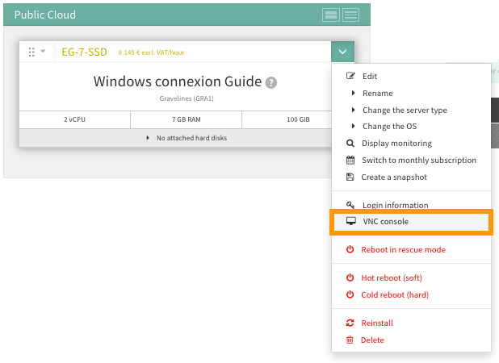
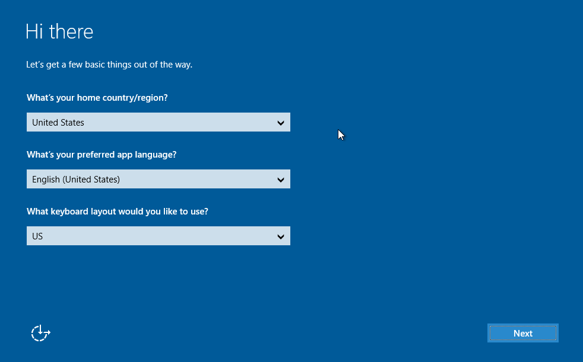
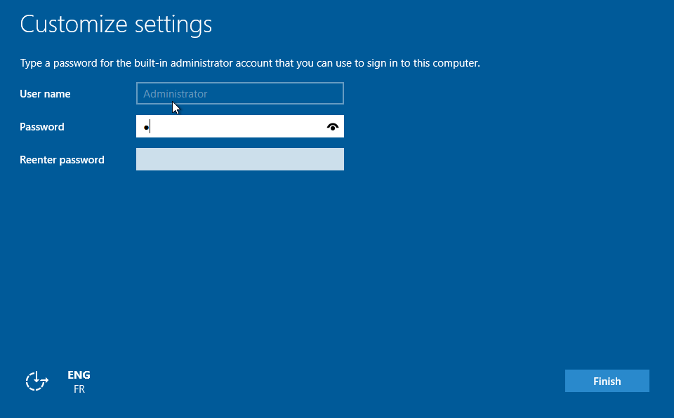
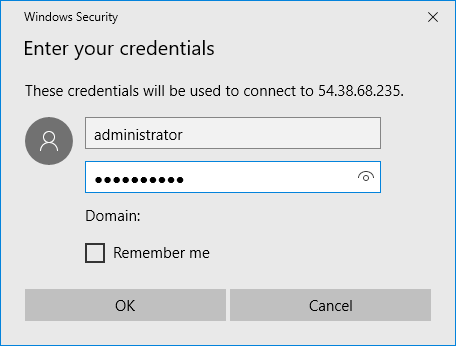

**Stand 23.08.2018**

## Einleitung

Der Login auf Ihre Public Cloud Instanz funktioniert auf dieselbe Weise wie ein „normaler“ Login auf einem dedizierten Server (VPS, Dedicated Server etc.), nur dass jede Instanz einen bestimmten Benutzer hat.

**In dieser Anleitung erfahren Sie, wie Sie sich über Windows oder Linux auf Ihren Public Cloud Instanzen einloggen können.**


## Voraussetzungen

- Sie sind in Ihrem [OVH Kundencenter](https://www.ovh.com/auth/?action=gotomanager){.external} eingeloggt.
- Sie haben eine [Public Cloud Instanz](https://www.ovh.de/public-cloud/instances/){.external} erstellt.


## Beschreibung

### Auf einer Linux-Instanz über Linux/Mac-Umgebung einloggen

Geben Sie folgenden SSH-Befehl ein, um sich auf Ihrer Public Cloud Instanz einzuloggen:

```sh
ssh *user*@IP_instance
```

Die Public Cloud Benutzer unterscheiden sich je nach verwendeter Distribution. In dieser Tabelle sehen Sie eine nicht vollständige Auflistung der Benutzer und zugehörigen Distributionen:

|Distribution|Benutzer|
|---|---|
|Archlinux|arch|
|Centos 6|centos|
|Centos 7|centos|
|CoreOS|core|
|Debian 7|debian|
|Debian 8|debian|
|Debian 9|debian|
|Fedora 25|fedora|
|Fedora 26|fedora|
|FreeBSD 11.0 ZFS|FreeBSD|
|Ubuntu 14.04|ubuntu|
|Ubuntu 16.04|ubuntu|
|Ubuntu 16.10|ubuntu|
|Ubuntu 17.04|ubuntu|

> [!primary]
>
> Wenn Sie sich direkt einloggen, verfügen Sie über die Rechte dieser Benutzer. Um *Superuser*-Rechte zu erhalten, verwenden Sie den `sudo`-Befehl.
>

- Warnung zum SSH-Fingerabdruck des Remote-Servers:

Bestätigen Sie bei Ihrem ersten Login die Authentizität des Hosts, indem Sie auf `yes` klicken.

```sh
The authenticity of host 217.xxx.xxx.98 (217.xxx.xx.98) cant be established.
ECDSA key fingerprint is f4:95:09:ce:b6:63:73:ea:54:db:76:5e:64:f1:5e:6d.
Are you sure you want to continue connecting (yes/no)?
```


### Auf einer Linux-Instanz über Windows-Umgebung einloggen

Um sich über Windows auf einer Linux-Instanz einzuloggen, können Sie entweder ein Softwareprogramm wie [PuTTY](https://www.putty.org/){.external} oder bei den aktuellen Windows-10-Versionen auch [native Funktionen](https://docs.microsoft.com/en-us/windows/wsl/about){.external} verwenden. Danach können Sie den oben beschriebenen Schritten folgen.


### Auf einer Windows-Instanz einloggen

#### Installation abschließen

Nach der Erstellung Ihrer Instanz muss *sysprep* ausgeführt werden. Starten Sie dazu die VNC-Konsole in Ihrem [OVH Kundencenter](https://www.ovh.com/auth/?action=gotomanager){.external}:



Im ersten Schritt können Sie Ihr Land, die gewünschte Sprache und die Tastatursprache auswählen. Klicken Sie danach auf `Next`{.action}:



Legen Sie im nächsten Schritt das *Administrator*-Passwort fest:



Bestätigen Sie Ihre Auswahl mit `Finish`{.action}. Die Instanz wird neu gestartet und Sie können sich auf Ihrem Windows Server einloggen.


#### In Windows einloggen

Sie können sich direkt über die `Remotedesktop`-Funktion auf Ihrer Windows-Instanz einloggen:


Geben Sie in den folgenden Schritten zunächst die IP-Adresse Ihrer Instanz an (erster Schritt beim Einloggen über den Remotedesktop) und anschließend Ihren Benutzernamen (*administrator*) sowie das Passwort, das Sie erstellt haben:




Sie werden dazu aufgefordert, den Login zu bestätigen. Klicken Sie dazu auf `Ja`{.action}:


Sie sind nun auf Ihrer Instanz eingeloggt.

> [!primary]
>
> Überprüfen Sie bei Verbindungsschwierigkeiten, ob die Windows Firewall RDP-Verbindungen zulässt. Für weitere Informationen lesen Sie die Anleitung zur [Erstkonfiguration von Windows Server](https://docs.ovh.com/de/vps/windows-first-config/){.external}.
>


## Weiterführende Informationen

Für den Austausch mit unserer User Community gehen Sie auf <https://community.ovh.com/en/>.