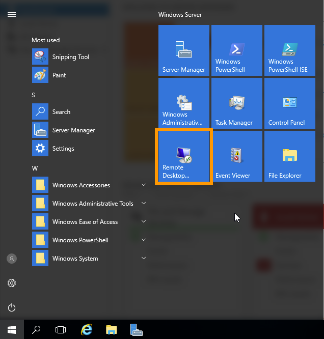
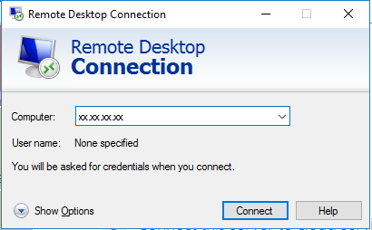

**Última atualização: 16/05/2018**

## Sumário

A conexão a uma instância Public Cloud é similar a uma conexão «normal» a um servidor dedicado (VPS, servidor dedicado, etc.), mas possui um utilizador específico.

**Este guia explica como pode conectar-se a instâncias Public Cloud em Linux ou em Windows.**


## Requisitos

- Ter acesso à [Área de Cliente OVH](https://www.ovh.com/auth/?action=gotomanager){.external}.
- Ter criado uma [instância Public Cloud](https://www.ovh.pt/public-cloud/instances/){.external}.


## Instruções

### Conectar-se a uma instância Linux a partir de um ambiente Linux/Mac

Este é o comando SSH para se conectar à sua instância Public Cloud:

```sh
ssh *user*@IP_instance
```

Em função das distribuições, o utilizador será diferente em Public Cloud. A seguir está um quadro (não exaustivo) dos utilizadores em função das distribuições:

|Distribuição|Utilizador|
|---|---|
|Archlinux|arch|
|Centos 6|centos|
|Centos 7|centos|
|CoreOS|core|
|Debian 7|debian|
|Debian 8|debian|
|Debian 9|debian|
|Fedora 25|fedora|
|Fedora 26|fedora|
|FreeBSD 11.0 ZFS|freeBSD|
|Ubuntu 14.04|ubuntu|
|Ubuntu 16.04|ubuntu|
|Ubuntu 16.10|ubuntu|
|Ubuntu 17.04|ubuntu|

> [!primary]
>
> Em conexão direta, terá as autorizações destes utilizadores. Se deseja utilizar os privilégios de *superutilizador*, terá de utilizar o comando `sudo`.
>


- Aviso quanto ao certificado digital do servidor SSH remoto:

Na primeira conexão, terá de confirmar a autenticidade do host clicando em `yes`.

```sh
The authenticity of host 217.xxx.xxx.98 (217.xxx.xx.98) cant be established.
ECDSA key fingerprint is f4:95:09:ce:b6:63:73:ea:54:db:76:5e:64:f1:5e:6d.
Are you sure you want to continue connecting (yes/no)?
```


### Conectar-se a uma instância Linux a partir de um ambiente Windows

Para se conectar a uma instância Linux a partir do Windows, basta utilizar um programa de tipo [PuTTY](https://www.putty.org/){.external} ou, para as versões mais recentes do Windows 10, utilizar as funções [já nativas](https://docs.microsoft.com/en-us/windows/wsl/about){.external}. A seguir, já só precisará de seguir as indicações anteriores para Linux.


### Conectar-se a uma instância Windows

#### Finalizar a instalação

Quando tiver criado a instância, é preciso finalizar o chamado *sysprep*. Para isso, na [Área de Cliente OVH](https://www.ovh.com/auth/?action=gotomanager){.external}, é preciso executar a consola VNC:


Durante a primeira etapa, poderá escolher o seu país, a língua desejada e a língua do teclado. A seguir, clique em `Next`{.action}:


Depois, deve escolher a palavra-passe para o utilizador *administrator*:


Resta validar a sua escolha com `Finish`{.action}. A instância vai reiniciar. Então poderá conectar-se ao seu servidor Windows.


#### Conectar-se a uma instância Windows

A conexão à sua instância Windows é feita diretamente através da função `Área de Trabalho remota`, a partir do seu computador Windows:



Nas etapas seguintes, bastará especificar o IP da sua instância (primeira etapa da conexão através da Área de Trabalho remota) e a seguir adicionar o seu username (*administrator*) e a palavra-passe que definiu:




Uma mensagem vai pedir-lhe que valide a conexão. Escolha `Sim`{.action} ou `Yes`{.action}:


Já está conectado à sua instância.

> [!primary]
>
> Em caso de problemas de conexão à sua instância Windows, verifique se a firewall do Windows autoriza conexões RDP. Recorra ao [guia correspondente](https://docs.ovh.com/fr/vps/windows-first-config/){.external} se precisar de mais informações.
>


## Quer saber mais?

Fale com a nossa comunidade de utilizadores: <https://community.ovh.com/en/>.