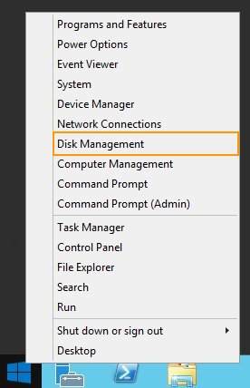
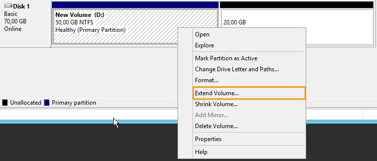

**Ostatnia aktualizacja dnia 2018-01-24**

## Wprowadzenie

Wolumen jest dodatkową przestrzenią dyskową dla instancji Public Cloud. Aby był widoczny w systemie plików należy utworzyć na nim partycję oraz system plików, następnie podmontować w systemie operacyjnym instancji. Przed usunięciem wolumenu należy go odmontować. W przeciwnym wypadku system operacyjny instancji może zwracać komunikat o uszkodzonej przestrzeni dyskowej.

Z punktu widzenia wykonania operacji usuwania dysku nie jest istotne czy dysk został odmontowany w systemie operacyjnym.

Niektóre polecenia będą wymagały wykonania ich z poziomu użytkownika root. Zwracaj uwagę na nazwy dysków, mogą być inne niż w załączonych przykładach. Jedynie administrator systemu może mieć pewność, który dysk jest dyskiem dodatkowym, gdyż nazwy dysków mogą być inne w każdym przypadku.


## Wymagania początkowe

- [Instancja Public Cloud](https://www.ovh.pl/public-cloud/instances/){.external}
- Dodatkowy dysk (wolumen)
- Dostęp do instancji


## W praktyce

### Montowanie wolumenu
 
#### Instancja z systemem Linux

##### Krok 1: Wyświet listę dysków w celu ustalenia ich oznaczenia, użyj polecenia `lsblk`

```sh
lsblk

NAME MAJ:MIN RM SIZE RO TYPE MOUNTPOINT
vda 254:0 0 10G 0 disk
└─vda1 254:1 0 10G 0 part /
vdb 254:16 0 10G 0 disk
```

VDA odnosi się do dysku instancji. VDB to dodatkowy dysk. Należy pamiętać, że nazwy dysków i partycji mogą być inne dla każdej instancji.

Aby polecenia podane w przewodniku działały, należy stosować nazewnictwo dysków i partycji występujące na danej instancji, co nie musi się pokrywać z nazwami użytymi w przykładach.


##### Krok 2: Utwórz partycję za pomocą polecenia `fdisk`

```sh
sudo fdisk /dev/vdb

Welcome to fdisk (util-linux 2.25.2).
Changes will remain in memory only, until you decide to write them.
Be careful before using the write command.
Device does not contain a recognized partition table.
Created a new DOS disklabel with disk identifier 0x95c4adcc.

Command (m for help): n

Partition type
p primary (0 primary, 0 extended, 4 free)
e extended (container for logical partitions)
Select (default p):
Using default response p.
Partition number (1-4, default 1):
First sector (2048-20971519, default 2048):
Last sector, +sectors or +size{K,M,G,T,P} (2048-20971519, default 20971519):

Created a new partition 1 of type 'Linux' and of size 10 GiB.

Command (m for help): w

The partition table has been altered.

Calling ioctl() to re-read partition table.
Syncing disks.
```

##### Krok 3: Sformatuj partycję poleceniem `mkfs` (ext4 jest to rodzaj systemu plików)

```sh
sudo mkfs.ext4 /dev/vdb1

mke2fs 1.42.12 (29-Aug-2014)

Creating filesystem with 2621184 4k blocks and 655360 inodes
Filesystem UUID: 781be788-c4be-462b-b946-88429a43c0cf
Superblock backups stored on blocks:
32768, 98304, 163840, 229376, 294912, 819200, 884736, 1605632

Allocating group tables: done
Writing inode tables: done
Creating journal (32768 blocks): done
Writing superblocks and filesystem accounting information: done
```

##### Krok 4: Zamontuj partycję poleceniem `mkdir`

```sh
sudo mkdir /mnt/disk
sudo mount /dev/vdb1 /mnt/disk/
```


##### Krok 5: Sprawdź montowanie poleceniem `df`

```sh
df -h

Filesystem Size Used Avail Use% Mounted on

/dev/vda1 9.8G 840M 8.6G 9% /

udev 10M 0 10M 0% /dev
tmpfs 393M 5.2M 388M 2% /run
tmpfs 982M 0 982M 0% /dev/shm
tmpfs 5.0M 0 5.0M 0% /run/lock
tmpfs 982M 0 982M 0% /sys/fs/cgroup
/dev/vdb1 9.8G 23M 9.2G 1% /mnt/disk
```

##### Krok 6: W przypadku montowania dysku trwałego trzeba zmodyfikować plik */etc/fstab*. Pobierz ID bloku

```sh
sudo blkid

/dev/vda1: UUID="51ba13e7-398b-45f3-b5f3-fdfbe556f62c" TYPE="ext4" PARTUUID="000132ff-01"
/dev/vdb1: UUID="2e4a9012-bf0e-41ef-bf9a-fbf350803ac5" TYPE="ext4" PARTUUID="95c4adcc-01"
```

##### Krok 7: Dodaj dysk do pliku */etc/fstab*

```sh
vim /etc/fstab

/etc/fstab: static file system information.

# Use 'blkid' to print the universally unique identifier for a
# device; this may be used with UUID= as a more robust way to name devices
# that works even if disks are added and removed. See fstab(5).
#
# <file system> <mount point> <type> <options> <dump> <pass>

UUID=51ba13e7-398b-45f3-b5f3-fdfbe556f62c / ext4 defaults 0 0
UUID=2e4a9012-bf0e-41ef-bf9a-fbf350803ac5 /mnt/disk ext4 nofail 0 0
```

#### Instancja z systemem Windows

##### Krok 1: Skorzystaj z narzędzia do zarządzania dyskiem

{.thumbnail}

##### Krok 2: Sformatuj dysk

Uwaga: Jeśli pojawi się komunikat `offline (the disk is offline because of policy set by an administrator)`, trzeba będzie zmodyfikować atrybuty dysków, klikając prawym przyciskiem na dysk i wybierając `Online` oraz `Initialize` lub używając `Diskpart`: Uruchom Powershell lub linię poleceń.


##### Krok 3: Weryfikacja zastosowanej konfiguracji

```sh
C:\> diskpart
DISKPART> san

SAN Policy : Offline Shared
```

##### Krok 4: Zmień konfigurację

```sh
DISKPART> san policy=OnlineAll
DiskPart successfully changed the SAN policy for the current operating system.
```

##### Krok 5: Zastosowanie wybranej konfiguracji na dodatkowym dysku

```sh
DISKPART> list disk
Disk ### Status Size Free Dyn Gpt
-------- ------------- ------- ------- --- ---
Disk 0 Online 200 GB 0 B
* Disk 1 Offline 10 GB 1024 KB
 DISKPART> select disk 1

Disk 1 is now the selected disk.
 DISKPART> attributes disk clear readonly

Disk attributes cleared successfully.
 DISKPART> attributes disk

Current Read-only State : No
Read-only : No
Boot Disk : No
Pagefile Disk : No
Hibernation File Disk : No
Crashdump Disk : No
Clustered Disk : No
 DISKPART> online disk

DiskPart successfully onlined the selected disk.
```

##### Krok 6: Uruchom dysk z poziomu narzędzia do zarządzania dyskami i rozpocznij formatowanie dysku

Po sformatowaniu dysku będziesz mógł dostać się do dysku z poziomu eksploratora plików.

### Odmontowywanie wolumenu

#### Instancja z systemem Linux

##### Krok 1: Wyświetl listę dysków używając polecenia `lsblk`

```sh
lsblk
NAME   MAJ:MIN RM SIZE RO TYPE MOUNTPOINT
sda      8:0    0  20G  0 disk 
└─sda1   8:1    0  20G  0 part /mnt
sdb      8:16   0  10G  0 disk 
└─sdb1   8:17   0  10G  0 part /mnt/sdb
sdc      8:32   0  13G  0 disk 
```


##### Krok 2: Odmontuj dodatkowy dysk

Użyj polecenia `umount` wskazując punkt montowania:

```sh
sudo umount /mnt/sdb/
```

#### Instancja z systemem Windows

##### Krok 1: Uruchom narzędzie do zarządzania dyskiem i kliknij prawym przyciskiem na swój dysk

{.thumbnail}

##### Krok 2: Kliknij na Extend Volume


## Sprawdź również

Przyłącz się do społeczności naszych użytkowników na stronie <https://community.ovh.com/en/>.