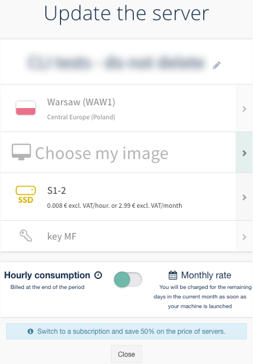
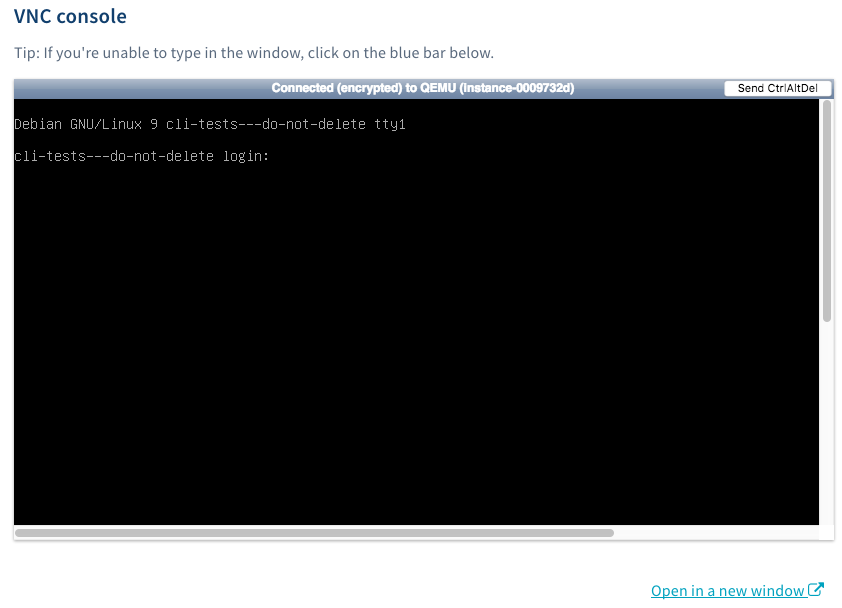
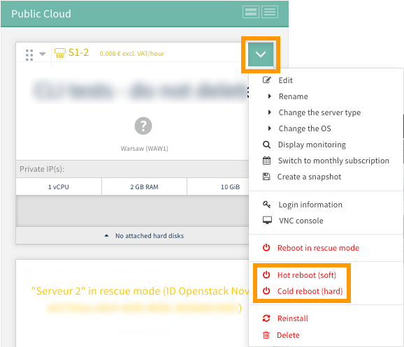

**Última actualización: 26/03/2019**

## Objetivo

Es posible gestionar las instancias de Public Cloud de OVH directamente desde el [área de cliente](https://www.ovh.com/auth/?action=gotomanager){.external}, donde podrá consultar todos sus proyectos de infraestructura (instancias, backups, discos, llaves SSH...) y de almacenamiento (incluida la lista de contenedores).

**Esta guía explica cómo empezar a utilizar una instancia de Public Cloud.**

### Requisitos

- [Haber creado una instancia de Public Cloud](../crear_una_instancia_desde_el_area_de_cliente_de_ovh/) desde su cuenta de cliente.
- [Haber creado una llave SSH](../crear-llave-ssh/).

### Procedimiento

### Acceder a la gestión de la instancia

Conéctese al [área de cliente de OVH](https://www.ovh.com/auth/?action=gotomanager){.external}, en la sección `Cloud`{.action}. En la columna izquierda, haga clic en `Servidores`{.action} y seleccione el servicio Public Cloud correspondiente. Por defecto, se abrirá la pestaña `Procesamiento`{.action} en `Instancias`{.action}.

En esa pantalla se mostrará la información relativa a sus instancias:

- modelo y precio de la instancia;
- nombre y región;
- recursos disponibles;
- discos adicionales asociados, si los hay;
- dirección IP de la instancia.

{.thumbnail}

### Editar la configuración de una instancia

En la página de gestión de las instancias, haga clic en la flecha situada en la esquina superior derecha de la instancia correspondiente y seleccione `Editar`{.action}.

{.thumbnail}

Se abrirá un cuadro de diálogo en el que podrá:

- renombrar la instancia;
- cambiar el modelo de la instancia;
- reinstalar la instancia con otro sistema operativo (**atención: esta operación eliminará los datos actuales**);
- cambiar la modalidad de pago de consumo por horas a tarifa mensual (se emitirá una factura por la parte proporcional al período restante del mes).

{.thumbnail}

### Crear una copia de seguridad de una instancia

Desde la página de gestión de las instancias, es posible crear una copia de seguridad de una instancia. Para ello, haga clic en la flecha situada en la esquina superior derecha de la instancia correspondiente y seleccione `Crear un snapshot`{.action}. Siga los pasos que se indican.

Para más información, consulte nuestra guía [Guardar una copia de seguridad de una instancia](../guardar_copia_de_seguridad_de_una_instancia/). 

{.thumbnail}

### Consultar la información de conexión

En la página de gestión de las instancias, haga clic en la flecha situada en la esquina superior derecha de la instancia correspondiente y seleccione `Datos de conexión`{.action}. Se abrirá un cuadro de diálogo en el que podrá ver el comando SSH que deberá utilizar para conectarse a la instancia.

{.thumbnail}

### Acceder a la consola VNC

La consola VNC permite acceder directamente a la instancia. Para ello, es necesario haber configurado previamente una contraseña para el usuario root.

Para acceder a esta consola, haga clic en la flecha situada en la esquina superior derecha de la instancia correspondiente y seleccione `Consola VNC`{.action}.

{.thumbnail}

La consola se abrirá en una nueva ventana. 

{.thumbnail}

### Reiniciar una instancia

Existen dos formas de reiniciar una instancia:

- reinicio en caliente (por software);
- reinicio en frío (por hardware).

En la página de gestión de las instancias, haga clic en la flecha situada en la esquina superior derecha de la instancia correspondiente y seleccione `Reiniciar en caliente (soft)`{.action} o `Reiniciar en frío (hard)`{.action}.

A continuación, confirme el reinicio.

{.thumbnail}

### Reinstalar una instancia

Es posible reinstalar una instancia manteniendo el mismo sistema operativo. **Esta operación eliminará todos los datos actuales.**

En la página de gestión de las instancias, haga clic en la flecha situada en la esquina superior derecha de la instancia correspondiente y seleccione `Reinstalar`{.action}. A continuación, confirme la operación. 

{.thumbnail}

### Eliminar una instancia

También es posible eliminar un instancia. **Esta operación eliminará de forma definitiva la instancia y todos los datos que contiene.**

En la página de gestión de las instancias, haga clic en la flecha situada en la esquina superior derecha de la instancia correspondiente y seleccione `Eliminar`{.action}. A continuación, confirme la operación. 

{.thumbnail}

## Más información

Interactúe con nuestra comunidad de usuarios en [ovh.es/community](https://www.ovh.es/community/){.external}.