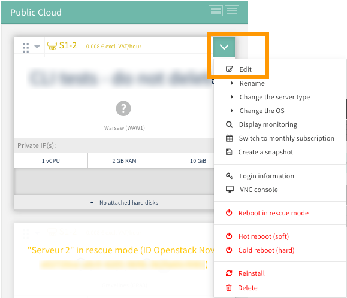

**Dernière mise à jour le 26/03/2018**

## Objectif

Vous avez la possibilité de gérer simplement vos instances Public Cloud OVH depuis votre [espace client](https://www.ovh.com/auth/?action=gotomanager){.external}. Vous y retrouverez l'ensemble de vos projets d'infrastructure (instances, sauvegardes, disques, clés SSH, etc.) et de stockage (comprenant la liste de vos conteneurs).

**Découvrez comment bien débuter avec une instance Public Cloud.**

### Prérequis

- [Avoir créé une instance Public Cloud d’OVH depuis votre compte](../creer-instance-espace-client/).
- [Avoir créé une clé SSH](../creation-des-cles-ssh/).

### En pratique

### Accéder à la gestion de l'instance

Débutez par vous connecter à l'[espace client OVH](https://www.ovh.com/auth/?action=gotomanager){.external} dans la partie « Cloud », puis cliquez sur `Serveurs`{.action} dans la barre de services à gauche. Sélectionnez alors le service Public Cloud concerné. Dans l'onglet `Compute`{.action}, assurez-vous aussi d'être bien positionné sur le choix « Instances ».

En dessous des onglets s'affiche le visuel de votre instance. Vous y retrouvez plusieurs informations :

- le modèle et le coût de votre instance ;
- son nom et sa région ;
- les ressources disponibles ;
- les éventuels disques additionnels attachés ;
- l'adresse IP de votre instance.

{.thumbnail}

### Éditer la configuration d'une instance

Depuis la page de gestion de l'instance, après avoir cliqué sur l'icône représentant une flèche vers le bas, sélectionnez `Éditer`{.action}.

{.thumbnail}

Dans la fenêtre qui apparaît, vous avez la possibilité de :

- renommer l'instance ;
- changer le modèle de l'instance ;
- réinstaller l'instance sur un autre système d'exploitation (**attention, les données actuelles seront supprimées durant cette opération**) ;
- passer d'une facturation à l'heure à un forfait mensuel (une facture sera alors générée au prorata temporis selon le jour du mois en cours).

{.thumbnail}

### Créer une sauvegarde d'une instance

Vous pouvez créer une sauvegarde d'une instance depuis la page de gestion de cette dernière. Pour cela, après avoir cliqué sur l'icône représentant une flèche vers le bas, sélectionnez `Créer une sauvegarde`{.action}. Suivez alors les étapes qui apparaissent.

Reportez-vous à notre guide « [Sauvegarder une instance](../sauvegarder-une-instance/) » pour vous accompagner dans cette démarche. 

{.thumbnail}

### Récupérer les informations de connexion

Depuis la page de gestion de l'instance, après avoir cliqué sur l'icône représentant une flèche vers le bas, choisissez `Informations de connexion`{.action}. Ceci vous permet de récupérer la commande SSH à utiliser pour vous connecter à votre instance.

{.thumbnail}

### Accéder à la console VNC

La console VNC vous permet d'avoir un accès direct à votre instance. Vous devez cependant avoir configuré un mot de passe pour l'utilisateur « root ».

Pour accéder à cette console, après avoir cliqué sur l'icône représentant une flèche vers le bas dans la page de gestion de l'instance, sélectionnez `Console VNC`{.action}.

{.thumbnail}

La console apparaît alors dans une fenêtre. 

{.thumbnail}

### Redémarrer une instance

Vous avez la possibilité de redémarrer une instance de deux manières différentes :

- redémarrage à chaud (logiciel) ;
- redémarrage à froid (matériel).

Depuis la page de gestion de l'instance, après avoir cliqué sur l'icône représentant une flèche vers le bas, choisissez ainsi `Redémarrer à chaud (soft)`{.action} ou `Redémarrer à froid (hard)`{.action}.

Confirmez ensuite le redémarrage dans la fenêtre qui apparaît.

{.thumbnail}

### Réinstaller une instance

Vous pouvez réinstaller une instance en conservant le même système d'exploitation. **Cette manipulation aura pour effet de supprimer toutes les données actuelles.**

Depuis la page de gestion de l'instance, après avoir cliqué sur l'icône représentant une flèche vers le bas, sélectionnez `Réinstaller`{.action}. Validez ensuite la manipulation. 

{.thumbnail}

### Supprimer une instance

Vous avez la possibilité de supprimer une instance. **Ceci entraînera l'effacement définitif de l'instance ainsi que de ses données.**

Depuis la page de gestion de l'instance, après avoir cliqué sur l'icône représentant une flèche vers le bas, choisissez `Supprimer`{.action}. Validez alors la manipulation. 

{.thumbnail}

## Aller plus loin

Échangez avec notre communauté d'utilisateurs sur <https://community.ovh.com>.