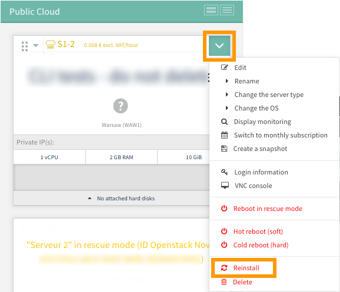
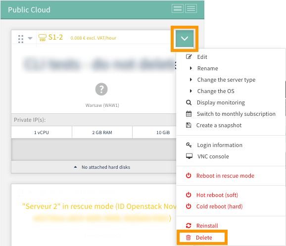

**Ostatnia aktualizacja z dnia 17-06-2019**

## Wprowadzenie

Możesz zarządzać Twoimi instancjami Public Cloud w [Panelu klienta](https://www.ovh.com/auth/?action=gotomanager){.external}. Znajdziesz w nim wszystkie Twoje projekty związane z infrastrukturą (instancje, kopie zapasowe, dyski, klucze SSH, etc.) oraz przestrzenią dyskową (zawierającą listę Twoich kontenerów).

**Dowiedz się, jak rozpocząć korzystanie z instancji Public Cloud.**

### Wymagania początkowe

- [Utworzenie instancji Public Cloud na Twoim koncie](../tworzenie_instancji_w_panelu_klienta_ovh/)
- [Posiadanie klucza SSH](../tworzenie-kluczy-ssh/)

### W praktyce

### Dostęp do interfejsu zarządzania instancją

Na początek zaloguj się do [Panelu klienta](https://www.ovh.com/auth/?action=gotomanager){.external} > sekcja „Cloud”, następnie kliknij `Serwery`{.action} na pasku usług po lewej stronie. Wybierz odpowiednią usługę Public Cloud. Upewnij się, czy w zakładce `Compute`{.action} wybrałeś „Instancje”.

Pod zakładkami wyświetla się grafika oznaczająca Twoją instancję. Odnajdziesz tam kilka informacji:

- model i cenę instancji;
- jej nazwę i region;
- dostępne zasoby;
- przypisane dodatkowe dyski;
- adres IP instancji.

{.thumbnail}

### Edycja konfiguracji instancji

Na stronie z interfejsem zarządzania instancją, po kliknięciu strzałki skierowanej w dół, wybierz `Edytuj`{.action}.

{.thumbnail}

W oknie, które się wyświetla możesz:

- zmienić nazwę instancji;
- zmienić model instancji;
- zainstalować inny system operacyjny na instancji (**uwaga, bieżące dane zostaną usunięte w wyniku tej operacji**);
- zmienić rozliczenie godzinowe na abonament miesięczny (faktura zostanie wówczas wystawiona na proporcjonalną kwotę należności za dni pozostałe do końca miesiąca).

{.thumbnail}

### Tworzenie kopii zapasowej instancji

Możesz utworzyć kopię zapasową instancji na stronie z interfejsem zarządzania instancjami. W tym celu, po kliknięciu strzałki w dół, wybierz `Utwórz kopię zapasową`{.action}. Następnie postępuj zgodnie z instrukcjami pojawiającymi się na kolejnych etapach.

Skorzystaj z naszego przewodnika [Tworzenie kopii zapasowej instancji](../kopia_zapasowa_instancji/). 

{.thumbnail}

### Pobranie danych do logowania

Na stronie z interfejsem zarządzania instancją, po kliknięciu strzałki skierowanej w dół, wybierz `Informacje o logowaniu`{.action}. Uzyskasz w ten sposób komendę SSH, której należy użyć, aby zalogować się do instancji.

{.thumbnail}

### Dostęp do konsoli VNC

Konsola VNC umożliwia bezpośredni dostęp do instancji. Najpierw skonfiguruj hasło dla użytkownika „root”.

Aby uzyskać dostęp do konsoli, po kliknięciu strzałki skierowanej w dół na stronie z interfejsem zarządzania instancją, wybierz `Konsola VNC`{.action}.

{.thumbnail}

Wówczas w oknie pojawi się konsola. 

{.thumbnail}

### Restart instancji 

Możesz zrestartować instancję, stosując jeden z dwóch sposobów:

- restart programowy;
- restart sprzętowy.

Na stronie z interfejsem zarządzania instancją, po kliknięciu strzałki skierowanej w dół, wybierz `Wykonaj restart programowy`{.action} lub `Wykonaj restart sprzętowy`{.action}.

Następnie potwierdź restart w oknie, które się wyświetli.

{.thumbnail}

### Reinstalacja instancji 

Możesz przeprowadzić reinstalację instancji, zachowując ten sam system operacyjny. **W wyniku tej operacji zostaną usunięte wszystkie bieżące dane.**

Na stronie z interfejsem zarządzania instancją, po kliknięciu strzałki skierowanej w dół, wybierz `Reinstaluj`{.action}. Zatwierdź następnie tę operację. 

{.thumbnail}

### Usuwanie instancji

Możesz usunąć instancję. **Spowoduje to ostateczne usunięcie instancji oraz wszystkich przechowywanych na niej danych.**

Na stronie z interfejsem zarządzania instancją, po kliknięciu strzałki skierowanej w dół, wybierz `Usuń`{.action}. Zatwierdź tę operację. 

{.thumbnail}

## Sprawdź również

Przyłącz się do społeczności naszych użytkowników na stronie <https://community.ovh.com/en/>.