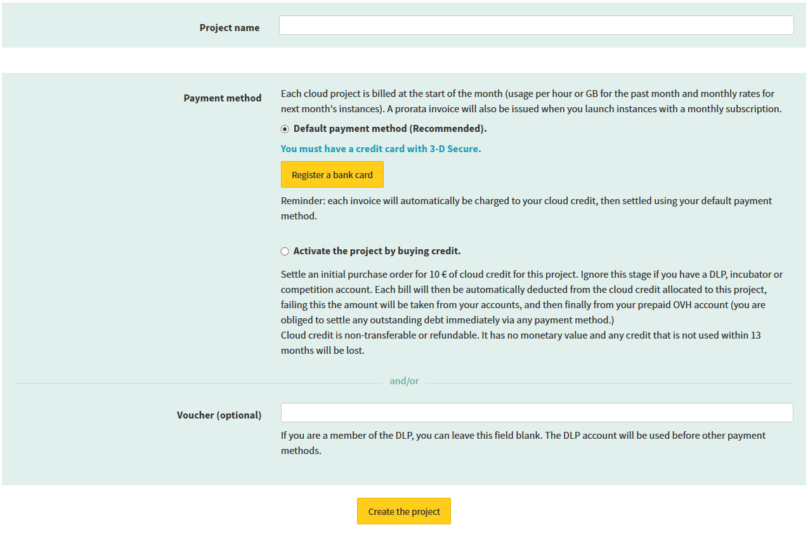
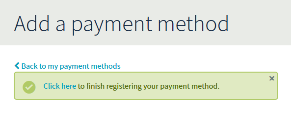
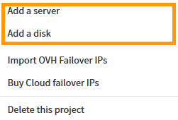

**Dernière mise à jour le 2 novembre 2018**

## Objectif

[Les instances Public Cloud](https://www.ovh.com/fr/public-cloud/instances/){.external} offrent une solution souple qui est payée à l’usage (Pay-as-you-go) pour gérer les ressources virtuelles. Cela veut dire que vous pouvez ajouter ou supprimer des ressources (instances, stockage, etc) au moment et de la manière dont vous en avez besoin.

**Ce guide vous montrera comment créer votre premier projet Public Cloud.**

## Prérequis

* Avoir accès à votre [espace client OVH](https://www.ovh.com/auth/?action=gotomanager){.external}

## Instructions

### Créer un projet

Connectez-vous à votre [Espace client OVH](https://www.ovh.com/auth/?action=gotomanager){.external}. Une fois connecté, cliquez sur le menu `Cloud`{.action}.

{.thumbnail}

Ensuite, cliquez sur le bouton `Commander`{.action}.

{.thumbnail}

Sous le menu 'Commander', cliquez sur Projet cloud.

{.thumbnail}

Vous devez maintenant donner un nom au projet et choisir un moyen de paiement.

{.thumbnail}

### Choisir un moyen de paiement

Comme nous venons de l’expliquer plus haut, Public Cloud est un service facturé à l’usage. Une fois votre projet créé, vous pouvez acheter des instances, du stockage, etc. Cependant, une fois votre premier projet créé, vous devrez choisir l’un de ces trois moyens de paiement :

#### Enregistrer une carte bancaire

C’est la méthode la plus simple. Quand vous enregistrez une carte bancaire, vous serez automatiquement débité en début de mois. Cette méthode va vous permettre d’enregistrer (en fonction de votre pays) :

* une carte de débit/crédit
* un compte de Paypal
* un compte bancaire

> [!primary]
>
S’il s’agit de votre premier paiement avec OVH, nous n’accepterons que des cartes de crédit 3-D Secure.
>

Sélectionnez votre moyen de paiement désiré parmi ceux de la liste et cliquez sur le bouton `Ajouter`{.action}.

{.thumbnail}

Une fois que vous avez cliqué sur le bouton `Ajouter`{.action}, vous serez invité à terminer la configuration de votre moyen de paiement, comme indiqué ci-dessous.

{.thumbnail}

#### Acheter du crédit cloud

Vous pouvez aussi payer pour votre [Public Cloud](https://www.ovh.com/fr/public-cloud/instances/){.external} avec du crédit cloud. Le paiement initial de crédit cloud sera de de 30€. Toutes les ressources que vous utiliserez après cela consommeront votre crédit. Lorsque votre crédit est épuisé, vous pouvez en acheter davantage en utilisant n’importe quel moyen de paiement accepté.

Le crédit cloud est non transférable ou remboursable. Il n'a aucune valeur monétaire et, s'il n'est pas utilisé dans les 13 mois, il sera perdu.

{.thumbnail}

#### Utiliser un bon de paiement

Si vous avez un code promotionnel, vous pouvez l'ajouter au cours de cette étape pour payer vos ressources. La durée du bon peut varier.

{.thumbnail}
 
Une fois votre projet créé, il sera disponible dans le menu de gauche.

### Ajouter une instance ou du stockage

Pour ajouter des ressources à votre nouveau projet, cliquez sur le bouton `Actions`{.action} sous l'onglet `Infrastructure`{.action}.

{.thumbnail}

Ensuite, dans le menu déroulant, sélectionnez `Ajouter un serveur`{.action} ou `Ajouter un disque`{.action}.

{.thumbnail}

## Aller plus loin

Échangez avec notre communauté d'utilisateurs sur <https://community.ovh.com/>.