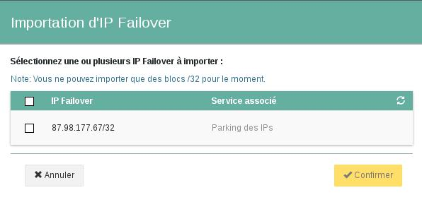
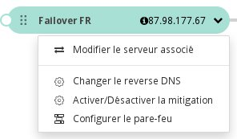

## 
Chcesz skonfigurować adres IP Fail Over na swoich instancjach, ponieważ:

- masz kilka stron na swojej instancji,
- obsługujesz międzynarodowe projekty,
- chcesz przenieść swoją działalność z serwera dedykowanego na instancje Public Cloud. 

Możesz zaimportować adres IP Fail Over związany z inną usługą OVH.

Przewodnik ten wyjaśnia, jak zaimportować ten adres IP Fail Over na projekt Public Cloud OVH.

## Wstępne wymagania

- Adres IP Fail Over przypisany do serwera dedykowanego. Przykład: W sekcji Dedykowane w panelu klienta widzimy dostępny adres IP:

{.thumbnail}

## Na Public Cloud

- Przejdź do sekcji Cloud w panelu klienta.
- Kliknij na 'Importuj adres IP Failover':

{.thumbnail}

- Pojawi się takie okno:

{.thumbnail}

- Zaznacz wybrane IP Fail Over i kliknij na Zatwierdź.
- Import zajmuje kilka sekund.

{.thumbnail}

- IP zostało zaimportowane:

{.thumbnail}

- Wybierz serwer wirtualny, do którego chcesz przypisać IP:

{.thumbnail}

- Zaznacz wybrany serwer:

{.thumbnail}

- Zatwierdź klikając na Przypisz.
- IP zostało przypisane.

{.thumbnail}

## Na serwer dedykowany
Możesz ponownie przenieść adres IP Fail Over na serwer dedykowany.

Przejdź do menu "IP" w sekcji "Dedykowane" w panelu klienta i kliknij na ikonkę znajdującą się z prawej strony adresu IP Fail Over:

{.thumbnail}
Następnie wystarczy przenieść adres IP na serwer dedykowany.

## 
[Przewodniki Cloud]({legacy}1785)

