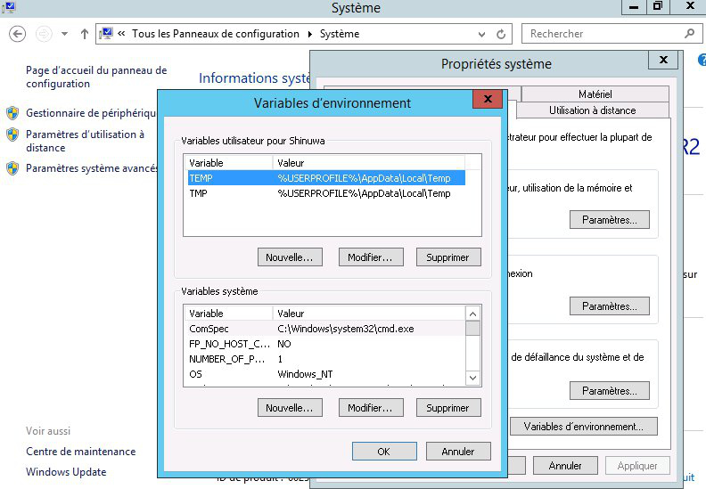

## Préambule
Dans le cadre de l'utilisation des clients OpenStack, il est nécessaire de charger les variables d'environnement permettant à vous authentifier sur nos points d'accès. Ce guide vous explique comment charger ces variables d'environnement afin de pouvoir vous authentifier et d'interagir avec vos différents services.


### Prérequis
- [Créer un utilisateur OpenStack]({legacy}1773){.ref}


## Recuperation des variables
Afin de récupérer vos variables d'environnement, vous pouvez télécharger le fichier OpenRC de votre utilisateur OpenStack. Pour cela, cliquez sur le bouton "Gestion et conso. du projet en haut à droite.


{.thumbnail}

Cliquez ensuite sur le bouton "OpenStack" sur la droite.


{.thumbnail}

Cliquez sur la clé tout à droite de votre utilisateur puis sélectionnez "Télécharger un fichier de configuration OpenStack" afin d'obtenir votre fichier OpenRC.


{.thumbnail}


## Chargement des variables

### Sous Linux
- Ouvrir un terminal, ou se connecter avec l'utilisateur qui fera les appels à l'API OpenStack
- Charger le contenu du fichier dans l'environnement courant, le mot de passe de l'utilisateur Horizon correspondant est demandé :

```bash
admin@vps187763:~$ source openrc.sh
Please enter your OpenStack Password:
```

- Si les CLI ont déjà été installés, on vérifie simplement le bon fonctionnement :

```bash
admin@vps187763:~$ nova list
+--------------------------------------+------+--------+------------+-------------+------------------------+
| ID                                   | Name | Status | Task State | Power State | Networks               |
+--------------------------------------+------+--------+------------+-------------+------------------------+
| 2278e269-a529-40cc-9a08-794fda9302d3 | deb8 | ACTIVE | -          | Running     | Ext-Net=149.202.173.76 |
+--------------------------------------+------+--------+------------+-------------+------------------------+
```

- Il est possible de stocker en dur le mot de passe de l'utilisateur Horizon, pour cela, remplacer :

```bash
export OS_PASSWORD=$OS_PASSWORD_INPUT
```

- Par :

```bash
export OS_PASSWORD="Mot de passe de l'utilisateur Horizon"
```

- Par défaut, il faudra charger cet environnement après chaque ouverture de session dans l'environnement courant, il est possible de rendre cela permanent en ajoutant le source openrc.sh au fichier bashrc, cela requiert de fixer le mot de passe dans le fichier


### Sous Windows
- [Télécharger ou créer le fichier openrc.sh d'OpenStack]({legacy}1774){.ref} afin de récupérer les informations pour vous authentifier.

Le fichier OpenRC n'est pas conçu pour être lancé sur Windows.

Vous avez donc 2 solutions pour charger les variables d'environnement :

- Il faudra adapter le fichier en modifiant certaines commandes, en effet, export peut être remplacé par set :

```bash
set OS_PASSWORD="Mot de passe de l'utilisateur Horizon"
```

- Il est possible de charger les variables directement depuis les paramètres systèmes : Panneau de configuration / Système / Paramètres systèmes avancés / Variables d'environnement :


{.thumbnail}