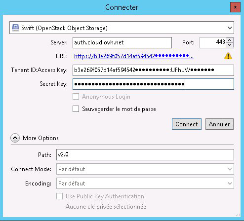

## Preambule
L'Object Storage est une solution de stockage qui se gère principalement à l'aide de l'API d'OpenStack. Cependant, il est possible que vous ne soyez pas familier avec cette façon de gérer un espace de stockage à l'aide principalement de ligne de commandes.

Il existe donc des solutions graphiques, qui utilisent de manière invisible les API d'OpenStack pour vous. CyberDuck fait partie de ces solutions et est facilement configurable.

D'autres interfaces sont aux disponibles et trouvables directement sur Internet, leurs configurations se dérouleront de manière similaire à celle que nous allons vous présenter.

Ce guide vous expliquera comment configurer Cyberduck afin de pouvoir gérer votre Object Storage a l'aide d'une interface graphique se basant sur les API Openstack.

### Prérequis
- [Un utilisateur Horizon configuré]({legacy}1773){.ref}
- L'identifiant de votre projet et de votre utilisateur, récupérable dans le menu [Accès et Sécurité dans Horizon]({legacy}1774){.ref} en téléchargeant le fichier OpenRC

## Configuration de Cyberduck
- Télécharger [Cyberduck](https://cyberduck.io/){.external}
- Se connecter sur un compte de type "Swift - OpenStack Object Storage"

{.thumbnail}

Différentes informations sont à renseigner dans le formulaire :

- Server : auth.cloud.ovh.net (Serveur d'authentification)
- Tenant ID:Access Key : Cela correspond a ID_du_Projet : ID_Utilisateur_Horizon
- Secret Key : le mot de passe de votre utilisateur Horizon
- More Options / Path : v2.0
- Se connecter

{.thumbnail}