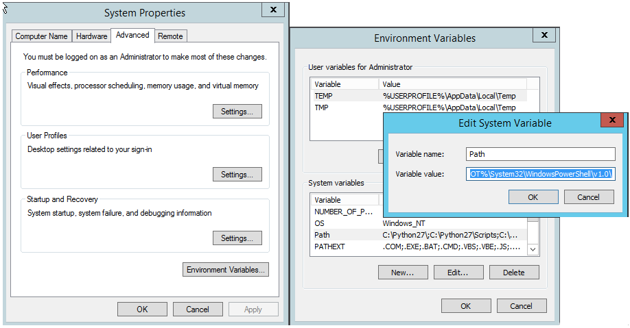

**Ostatnia aktualizacja z dnia 08-02-2019**

## Wprowadzenie

Usługami Public Cloud można zarządzać przy użyciu poleceń z konsoli systemowej, po uprzednim pobraniu i zainstalowaniu narzędzi OpenStack.

Dzięki API OpenStack możesz zautomatyzować zarządzanie usługami, tworząc skrypty. Klient Nova OpenStack umożliwia zarządzanie instancjami i przestrzenią dyskową. Klient Glance OpenStack oferuje możliwość zarządzania obrazami i kopiami zapasowymi. Klient Swift natomiast pozwala zarządzać przestrzenią Object Storage.

**Dowiedz się, jak zainstalować narzędzia OpenStack.**

## Wymagania początkowe

- Posiadanie dostępu **root** do środowiska, które chcesz skonfigurować 

## W praktyce

### Debian

Otwórz terminal lub połącz się przez SSH ze środowiskiem, które chcesz przygotować.

Zaktualizuj cache pakietów, używając polecenia `apt-get update`: 

```sh
apt-get update
```

Użyj poniższego polecenia do instalacji klientów Nova (aplikacja obliczeniowa), Glance (usługa obrazów) i Swift:

```sh
apt-get install python-openstackclient python-novaclient -y
```

Po zakończeniu tego etapu zalecamy utworzenie oddzielnego użytkownika zamiast korzystania z użytkownika root.

Aby uzyskać dostęp do narzędzia pomocy, wprowadź następujące polecenie:

```sh
openstack --help
nova help
```

> [!primary]
> 
> Dokumentacja dotycząca API OpenStack dostępna jest [na tej stronie](https://docs.openstack.org/python-openstackclient/latest/){.external}.
> 

### CentOS

Otwórz terminal lub połącz się przez SSH ze środowiskiem, które chcesz przygotować.

Zaktualizuj cache pakietów, używając polecenia apt-get update: 

```sh
yum update
```
Zainstaluj rpm rdo-release za pomocą następującego polecenia:

```sh
yum install -y https://rdoproject.org/repos/rdo-release.rpm
```

Następnie zainstaluj klienta OpenStack:

```sh
yum install -y python-openstackclient
```

Na koniec zainstaluj klienta Nova:

```sh
yum install -y python-novaclient
```

Po zakończeniu tego etapu zalecamy utworzenie oddzielnego użytkownika zamiast korzystania z użytkownika root.

Aby uzyskać dostęp do narzędzia pomocy, wprowadź następujące polecenie:

```sh
openstack --help
nova help
```

> [!primary]
> 
> Dokumentacja dotycząca API OpenStack dostępna jest [na tej stronie](https://docs.openstack.org/python-openstackclient/latest/){.external}.
> 

### Windows

Pobierz i zainstaluj wersję Python 2.7.10. Możesz wybrać automatyczne dodanie języka programowania Python do ścieżki (path), zaznaczając tę opcję w konfiguratorze instalacji:

{.thumbnail}

Możesz również przeprowadzić instalację samodzielnie. W tym celu postępuj zgodnie z instrukcjami podanymi poniżej:

#### Etap 1: edytuj zmienne środowiskowe systemu

Wyszukaj parametry zmiennych środowiskowych systemu i przejdź do „Edycja zmiennych środowiskowych systemu”:

{.thumbnail}

#### Etap 2: edycja parametrów systemu

Przejdź do zakładki `Zaawansowane`{.action} i kliknij `Zmienne środowiskowe`{.action}, aby edytować parametry.

{.thumbnail}

#### Etap 3: skonfiguruj zmienne środowiskowe 

W sekcji „Zmienne systemowe” wybierz „Nowy”, nadaj nazwę „PYTHON_HOME” i dodaj ścieżkę do Python’a. Domyślnie będzie wyglądała ona następująco: « C:\\Python27 ».

{.thumbnail}

#### Etap 4: dodanie ścieżki dla zmiennych

Po dodaniu „Python”, edytuj ścieżkę (Path) w zmiennych systemowych i dodaj na końcu ścieżki:

`...;%PYTHON_HOME%\;%PYTHON_HOME%\Script`

#### Etap 5: restart systemu Windows

Wprowadzone modyfikacje zostaną uwzględnione po restarcie systemu.

#### Etap 6: instalacja klienta OpenStack

Zaloguj się jako administrator i otwórz program przy użyciu wiersza poleceń (CMD), po czym zainstaluj klienta OpenStack, wprowadzając następujące polecenie:

```sh
# pip install python-openstackclient
```

Jeśli operacja została przeprowadzona poprawnie, wyświetli się podsumowanie:

{.thumbnail}

Możesz sprawdzić wersję instalacyjną w nowo otwartym oknie CMD (wiersz poleceń), wprowadzając „python-V” z dowolnego miejsca w systemie.

{.thumbnail}

## Sprawdź również

Przyłącz się do społeczności naszych użytkowników na stronie <https://community.ovh.com/en/>.

