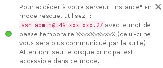

## 
W przypadku nieprawidłowej konfiguracji lub utraty kluczy SSH możesz mieć problem z dostępem do swoich instancji. 
Proponujemy tryb rescue, który pozwala na dostęp do danych, w celu poprawieniu plików konfiguracyjnych.

Funkcja ta działa w prosty sposób:
Instancja jest uruchamiana z nowego obrazu, czyli jako instancja z podstawową konfiguracją. 
Dysk instancji jest podpięty do instancji jako dysk dodatkowy. Wystarczy go zamontować, aby uzyskać dostęp do danych. 

Przewodnik ten wyjaśnia, jak używać trybu rescue.


## Wstępne wymagania

- [Utwórz instancję w panelu klienta OVH]({legacy}1775)


## Przełączenie w tryb rescue
Aby przełączyć serwer w tryb rescue, kliknij na strzałkę z prawej strony instancji i wybierz "Uruchom w trybie rescue":

{.thumbnail}
Następnie należy wybrać obraz, na którym chcesz uruchomić swój serwer w trybie rescue:

{.thumbnail}
Znajdziesz tu domyślnie proponowane obrazy oraz jeden obraz dodatkowy "Dystrybucja Rescue Made-in-OVH", który pozwala na zalogowanie się do instancji w trybie rescue za pomocą tymczasowego hasła. 

Po uruchomieniu serwera w trybie rescue pojawi się nowe okno z tymczasowym hasłem:

{.thumbnail}


## Dostęp do danych
Dane dostępne na instancji będą widoczne w trybie rescue jako dodatkowy dysk. Aby uzyskać do nich dostęp, wystarczy zamontować ten dysk zgodnie z poniższymi wskazówkami:


- Zaloguj się jako root:


```
admin@instance:~$ sudo su
```


- Sprawdź dostępne dyski:


```
root@instance:/home/admin# lsblk
NAME MAJ:MIN RM SIZE RO TYPE MOUNTPOINT
vda 253:0 0 1G 0 disk
└─vda1 253:1 0 1023M 0 part /
vdb 253:16 0 10G 0 disk
└─vdb1 253:17 0 10G 0 part
```


- Zamontuj partycję:


```
root@instance:/home/admin# mount /dev/vdb1 /mnt
```


Twoje dane są teraz dostępne w katalogu /mnt.

Możesz na przykład edytować plik z listą kluczy SSH dla użytkownika admin:


```
root@instance:/home/admin# vim /mnt/home/admin/.ssh/authorized_keys
```


## Normalne uruchomienie instancji
Po wykonaniu operacji można uruchomić instancję w normalnym trybie. Wystarczy kliknąć na strzałkę w prawym górnym rogu instancji i wybrać "Wyjdź z trybu rescue":

{.thumbnail}


## Z poziomu API OpenStack
Możesz uruchomić instancję w trybie rescue z poziomu API OpenStack korzystając z poniższego polecenia:


```
root@server:~# nova rescue INSTANCE_ID
```


Aby wyjść z trybu rescue, skorzystaj z tego polecenia:


```
root@server:~# nova unrescue INSTANCE_ID
```


## 

- [Tworzenie kluczy SSH]({legacy}1769)
- [Konfigurowanie dodatkowych kluczy SSH]({legacy}1924)


## 
[Przewodniki Cloud]({legacy}1785)

