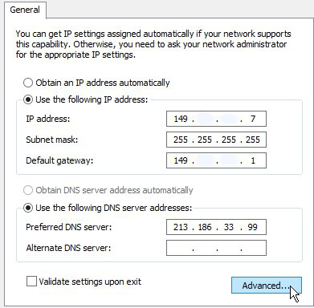

## 
Sie möchten eine Failover-IP-Adresse auf einer Ihrer Instanzen konfigurieren, weil Sie zum Beispiel:

- Mehrere Websites auf Ihrer Instanz betreiben oder
- Internationale Projekte hosten möchten

Sie können dann eine neue Failover-IP bestellen oder eine Vorhandene importieren und mit Ihren Public Cloud Instanzen nutzen.

Die Failover-IPs werden jedoch nicht automatisch auf Ihrer Instanz konfiguriert. 

In dieser Anleitung wird die Konfiguration des Netzwerk-Interfaces zum Hinzufügen der Failover-IP-Adresse zu Ihrer Instanz beschrieben.

## Voraussetzungen

- [Eine erstellte Instanz im OVH Kundencenter]({legacy}1775)
- Eine Failover-IP-Adresse

## Konfiguration des Interfaces
Windows erlaubt im DHCP Modus nicht die Konfiguration einer Failover-IP als Ergänzung der Konfiguration der Haupt-IP.
Sie müssen deshalb Ihre Netzwerkkarte von Hand konfigurieren.

- Abruf der Informationen mit dem Befehl "ipconfig":

{.thumbnail}

- Begeben Sie sich in die Systemsteuerung und rufen Sie das Netzwerk- und Freigabecenter auf:

{.thumbnail}

- Die Einstellungen der Karte ändern:

{.thumbnail}

- Zugriff auf die Eigenschaften Ihres Interfaces:

{.thumbnail}

- Konfiguration des TCP/IPv4 Protokolls

{.thumbnail}

- Stellen Sie auf die manuelle Konfiguration um und tragen Sie eine an den unten aufgeführten Screenshot angepasste Konfiguration ein. Passen Sie die IP-Adressen anhand der von Ihnen mit dem Befehl "ipconfig" gewonnenen Informationen an und klicken Sie dann auf "Fortgeschritten:

{.thumbnail}

- Fügen Sie Ihre Failover-IP wie folgt hinzu:

{.thumbnail}

## 

- [Umzug einer Failover-IP]({legacy}1890)

## 
[Zurück zum Index der Cloud Hilfen]({legacy}1785)

