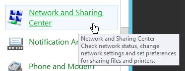
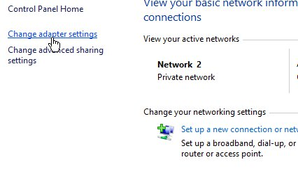

## 
Chcesz skonfigurować adres IP Fail Over na swoich instancjach, ponieważ:

- masz kilka stron na swojej instancji,
- obsługujesz projekty międzynarodowe.

Możesz zamówić i zaimportować adres IP Fail Over dla swoich instancji Public Cloud. 

Adresy IP Fail Over nie są automatycznie konfigurowane na instancji.

Przewodnik ten wyjaśnia, jak skonfigurować interfejs sieciowy instancji, aby dodać do niej adres IP Fail Over.

## Wstępne wymagania

- [Utworzenie instancji w panelu klienta OVH]({legacy}1775)
- Adres IP Failover

## Konfiguracja interfejsu
Windows nie akceptuje konfigurowania adresu IP Failover jako uzupełnienie konfiguracji głównego adresu IP w DHCP. 
Należy więc ręcznie zmienić konfigurację karty sieciowej z dostarczonym IP.

- Pobierz informacje sieciowe za pomocą "ipconfig":

{.thumbnail}

- Przejdź do panelu sterowania i wybierz centrum sieci i udostępniania:

{.thumbnail}

- Zmień ustawienia karty:

{.thumbnail}

- Przejdź do właściwości interfejsu:

{.thumbnail}

- Przejdź do konfiguracji protokołu TCP/IPv4

{.thumbnail}

- Zmień tryb na ręczny i skorzystaj z konfiguracji przedstawionej poniżej dostosowując adresy IP w zależności od informacji, które otrzymałeś za pomocą ipconfig" klikając na "Zaawansowane:

{.thumbnail}

- Dodaj IP Failover:

{.thumbnail}

## 

- [Przeniesienie IP Fail Over]({legacy}1890)

## 
[Przewodniki Cloud]({legacy}1785)

