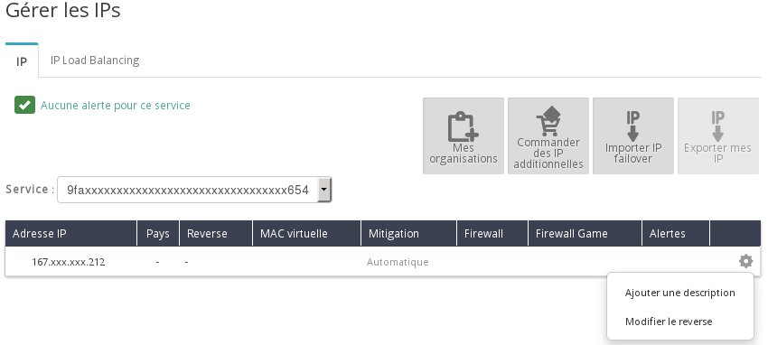
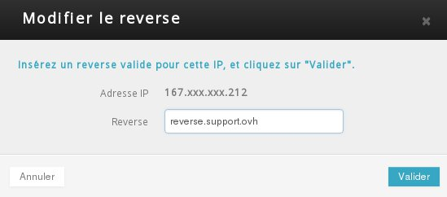

## 
Caso deseje configurar um servidor de e-mail, por exemplo, será necessário configurar uma reverse DNS para a sua instância de forma a melhor o envio dos e-mails.
Este guia explica-lhe como poderá configurar uma reverse DNS para os endereços IP das suas instâncias.

## Pré-requisitos

- Uma instância
- Um registo A presente na sua zona DNS e que aponta para o endereço IP da sua instância

## 

- Verificar o endereço IP da sua instância na secção Cloud do manager OVH:

{.thumbnail}

- Aceder à secção Dedicado do Espaço Cliente

{.thumbnail}

- Aceda ao separador IP e selecione o IP do projeto em Serviço :

{.thumbnail}

- Selecione Modificar a reverse ao clicar no ícone que lhe é apresentado à direeita do IP em questão.

- Introduza a sua reverse DNS no campo correspondente e valide

{.thumbnail}
Para que esta etapa seja efetuada corretamente, é necessário aguardar a propagação da sua zona DNS caso a adição do campo A seja recente.
A reverse DNS ficará de seguida disponível na lista dos endereços IP do seu projeto.

{.thumbnail}

## 
[Voltar à página principal dos guias Cloud]({legacy}1785)

